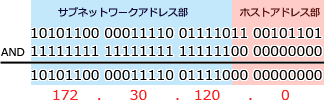

# [令和5年秋期 午前 問34](https://www.ap-siken.com/kakomon/05_aki/q34.html)

#問題 #テクノロジ #ネットワーク #通信プロトコル

解説を表示解説を隠す

<strong>問34</strong>　サブネットマスクが 255.255.252.0 のとき，IPアドレス 172.30.123.45 のホストが属するサブネットワークのアドレスはどれか。

<ul class="ap-choices">
<li class="ap-choice-item ap-wrong">

ア　172.30.3.0

<a href="用語/IPアドレス" class="internal-link" data-href="用語/IPアドレス">IPアドレス</a>と<a href="用語/サブネットマスク" class="internal-link" data-href="用語/サブネットマスク">サブネットマスク</a>の<a href="用語/論理積" class="internal-link" data-href="用語/論理積">論理積</a>の計算結果と一致しません。

</li>
<li class="ap-choice-item ap-correct">

イ　172.30.120.0

正しい。<a href="用語/IPアドレス" class="internal-link" data-href="用語/IPアドレス">IPアドレス</a> 172.30.123.45 と<a href="用語/サブネットマスク" class="internal-link" data-href="用語/サブネットマスク">サブネットマスク</a> 255.255.252.0 の<a href="用語/論理積" class="internal-link" data-href="用語/論理積">論理積</a>が 172.30.120.0 となるネットワークアドレスです。

</li>
<li class="ap-choice-item ap-wrong">

ウ　172.30.123.0

172.30.120.0/22 のネットワークに属するアドレスですが、ホスト<a href="用語/アドレス部" class="internal-link" data-href="用語/アドレス部">アドレス部</a>が全部0ではないためネットワークアドレスではありません。

</li>
<li class="ap-choice-item ap-wrong">

エ　172.30.252.0

<a href="用語/IPアドレス" class="internal-link" data-href="用語/IPアドレス">IPアドレス</a>と<a href="用語/サブネットマスク" class="internal-link" data-href="用語/サブネットマスク">サブネットマスク</a>の<a href="用語/論理積" class="internal-link" data-href="用語/論理積">論理積</a>の計算結果と一致しません。

</li>
</ul>

<h4>解説</h4>

<a href="用語/サブネットマスク" class="internal-link" data-href="用語/サブネットマスク">サブネットマスク</a>は、<a href="用語/IPアドレス" class="internal-link" data-href="用語/IPアドレス">IPアドレス</a>をネットワークアドレスとホストアドレスに区分するために使用される<a href="用語/ビット" class="internal-link" data-href="用語/ビット">ビット</a>列です。ネットワーク<a href="用語/アドレス部" class="internal-link" data-href="用語/アドレス部">アドレス部</a>には"1"を、ホスト<a href="用語/アドレス部" class="internal-link" data-href="用語/アドレス部">アドレス部</a>には"0"が指定され、その<a href="用語/IPアドレス" class="internal-link" data-href="用語/IPアドレス">IPアドレス</a>がどのネットワークに属するか、ホストアドレスは何番かを意味付けする役割を果たします。

<a href="用語/サブネットマスク" class="internal-link" data-href="用語/サブネットマスク">サブネットマスク</a> 255.255.252.0 を2進数で表現すると以下のようになります。

11111111 11111111 11111100 00000000

上位から（左から数えて）22<a href="用語/ビット" class="internal-link" data-href="用語/ビット">ビット</a>目までがネットワーク<a href="用語/アドレス部" class="internal-link" data-href="用語/アドレス部">アドレス部</a>、残った10<a href="用語/ビット" class="internal-link" data-href="用語/ビット">ビット</a>がホスト<a href="用語/アドレス部" class="internal-link" data-href="用語/アドレス部">アドレス部</a>ということです。

<a href="用語/IPアドレス" class="internal-link" data-href="用語/IPアドレス">IPアドレス</a>の属するネットワークを知りたいときは、<a href="用語/IPアドレス" class="internal-link" data-href="用語/IPアドレス">IPアドレス</a>と<a href="用語/サブネットマスク" class="internal-link" data-href="用語/サブネットマスク">サブネットマスク</a>の<a href="用語/論理積" class="internal-link" data-href="用語/論理積">論理積</a>(AND)を取ります。<a href="用語/IPアドレス" class="internal-link" data-href="用語/IPアドレス">IPアドレス</a>からネットワーク部の<a href="用語/ビット" class="internal-link" data-href="用語/ビット">ビット</a>列だけを取り出すイメージです。

対象となる<a href="用語/IPアドレス" class="internal-link" data-href="用語/IPアドレス">IPアドレス</a> 172.30.123.45 を2進数に変換して、<a href="用語/サブネットマスク" class="internal-link" data-href="用語/サブネットマスク">サブネットマスク</a>との<a href="用語/論理積" class="internal-link" data-href="用語/論理積">論理積</a>を求めると次のようになります。

結果の<a href="用語/ビット" class="internal-link" data-href="用語/ビット">ビット</a>列を<a href="用語/IPv4" class="internal-link" data-href="用語/IPv4">IPv4</a>表記にすると 172.30.120.0 なので、これが 172.30.123.45 が属するサブネットワークのネットワークアドレスとなります。したがって「イ」が正解です。

なお「ウ」の 172.30.123.0 は、 172.30.120.0/22 のネットワークに属しますが、ホスト<a href="用語/アドレス部" class="internal-link" data-href="用語/アドレス部">アドレス部</a>が全部0ではないためネットワークアドレスではありません。

