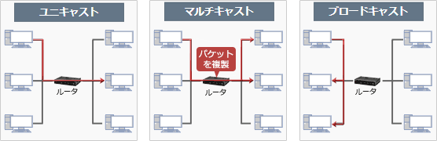

# [令和5年秋期 午前 問35](https://www.ap-siken.com/kakomon/05_aki/q35.html)

#問題 #テクノロジ #ネットワーク #通信プロトコル

解説を表示解説を隠す

<strong>問35</strong>　IPv4ネットワークにおけるマルチキャストの使用例に関する記述として，適切なものはどれか。

<ul class="ap-choices">
<li class="ap-choice-item ap-wrong">

ア　LANに初めて接続するPCが，DHCPプロトコルを使用して，自分自身に割り当てられるIPアドレスを取得する際に使用する。

<a href="用語/DHCP" class="internal-link" data-href="用語/DHCP">DHCP</a>で<a href="用語/IPアドレス" class="internal-link" data-href="用語/IPアドレス">IPアドレス</a>の割当てを受けるときには<a href="用語/ブロードキャスト" class="internal-link" data-href="用語/ブロードキャスト">ブロードキャスト</a>が使われる。<a href="用語/クライアント" class="internal-link" data-href="用語/クライアント">クライアント</a>は、<a href="用語/ブロードキャスト" class="internal-link" data-href="用語/ブロードキャスト">ブロードキャスト</a>で<a href="用語/DHCP" class="internal-link" data-href="用語/DHCP">DHCP</a><a href="用語/サーバ" class="internal-link" data-href="用語/サーバ">サーバ</a>を探索する。

</li>
<li class="ap-choice-item ap-wrong">

イ　ネットワーク機器が，ARPプロトコルを使用して，宛先IPアドレスからMACアドレスを得るためのリクエストを送信する際に使用する。

<a href="用語/ARP" class="internal-link" data-href="用語/ARP">ARP</a>で<a href="用語/IPアドレス" class="internal-link" data-href="用語/IPアドレス">IPアドレス</a>に対応する<a href="用語/MAC" class="internal-link" data-href="用語/MAC">MAC</a>アドレスを取得するときには<a href="用語/ブロードキャスト" class="internal-link" data-href="用語/ブロードキャスト">ブロードキャスト</a>が使用される。要求元は、解決したい<a href="用語/IPアドレス" class="internal-link" data-href="用語/IPアドレス">IPアドレス</a>を含めた<a href="用語/ARP" class="internal-link" data-href="用語/ARP">ARP</a>リクエストをネットワークに<a href="用語/ブロードキャスト" class="internal-link" data-href="用語/ブロードキャスト">ブロードキャスト</a>する。

</li>
<li class="ap-choice-item ap-wrong">

ウ　メーリングリストの利用者が，SMTPプロトコルを使用して，メンバー全員に対し、同一内容の電子メールを一斉送信する際に使用する。

メーリングリストでは、メーリングリスト用の宛先アドレスにメールを<a href="用語/ユニキャスト" class="internal-link" data-href="用語/ユニキャスト">ユニキャスト</a>で送信し、それを受信したメーリングリスト<a href="用語/サーバ" class="internal-link" data-href="用語/サーバ">サーバ</a>が複製したメールを登録者全員に<a href="用語/ユニキャスト" class="internal-link" data-href="用語/ユニキャスト">ユニキャスト</a>で送信する仕組みになっている。

</li>
<li class="ap-choice-item ap-correct">

エ　ルータがRIP-2プロトコルを使用して，隣接するルータのグループに，経路の更新情報を送信する際に使用する。

正しい。<a href="用語/マルチキャスト" class="internal-link" data-href="用語/マルチキャスト">マルチキャスト</a>は、RIP-2やOSPFといったルーティングプロトコルにおいて、隣接する<a href="用語/ルータ" class="internal-link" data-href="用語/ルータ">ルータ</a>同士が経路情報を交換するために用いられている。なお、RIP-1では<a href="用語/ブロードキャスト" class="internal-link" data-href="用語/ブロードキャスト">ブロードキャスト</a>だった。

</li>
</ul>

<h4>解説</h4>

<a href="用語/マルチキャスト" class="internal-link" data-href="用語/マルチキャスト">マルチキャスト</a>は、1回の送信で特定のグループに属する複数のホストにIP<a href="用語/パケット" class="internal-link" data-href="用語/パケット">パケット</a>を送信する方法です。1回で1つのホストに送信する<a href="用語/ユニキャスト" class="internal-link" data-href="用語/ユニキャスト">ユニキャスト</a>と、1回で同じネットワークセグメントに属するすべてのホストに同報送信する<a href="用語/ブロードキャスト" class="internal-link" data-href="用語/ブロードキャスト">ブロードキャスト</a>の中間に位置する送信方法と言えます。

現状、<a href="用語/マルチキャスト" class="internal-link" data-href="用語/マルチキャスト">マルチキャスト</a>が使用される場面は決して多くはありませんが、①<a href="用語/ルータ" class="internal-link" data-href="用語/ルータ">ルータ</a>を越えた先の複数のホストに対して同報通信できること、②関係ないホストへの通信が生じないこと、③通信<a href="用語/パケット" class="internal-link" data-href="用語/パケット">パケット</a>が適宜<a href="用語/ルータ" class="internal-link" data-href="用語/ルータ">ルータ</a>で複製されるためネットワーク負荷を小さくできる利点から、音声・動画配信やビデオ会議などの<a href="用語/ストリーミング" class="internal-link" data-href="用語/ストリーミング">ストリーミング</a>やルーティングプロトコルで用いられています。

IP通信では、宛先<a href="用語/IPアドレス" class="internal-link" data-href="用語/IPアドレス">IPアドレス</a>を複数指定することはできないので、<a href="用語/マルチキャスト" class="internal-link" data-href="用語/マルチキャスト">マルチキャスト</a>通信では<a href="用語/マルチキャスト" class="internal-link" data-href="用語/マルチキャスト">マルチキャスト</a>のグループを示す特別な<a href="用語/IPアドレス" class="internal-link" data-href="用語/IPアドレス">IPアドレス</a>（クラスD：224.0.0.0～239.255.255.255）を宛先として使用します。

したがって「エ」が正解です。

