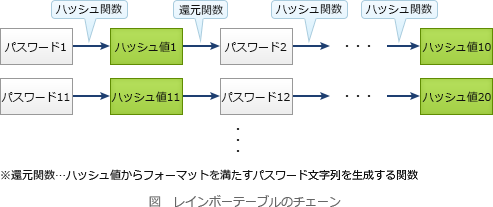
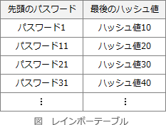

# [令和5年秋期 午前 問36](https://www.ap-siken.com/kakomon/05_aki/q36.html)

#問題 #テクノロジ #セキュリティ #情報セキュリティ

解説を表示解説を隠す

<strong>問36</strong>　パスワードクラック手法の一種である，レインボーテーブル攻撃に該当するものはどれか。

<ul class="ap-choices">
<li class="ap-choice-item ap-wrong">

ア　何らかの方法で事前に利用者IDと平文のパスワードのリストを入手しておき，複数のシステム間で使い回されている利用者IDとパスワードの組みを狙って，ログインを試行する。

これは<a href="用語/パスワードリスト攻撃" class="internal-link" data-href="用語/パスワードリスト攻撃">パスワードリスト攻撃</a>の説明です。

</li>
<li class="ap-choice-item ap-wrong">

イ　パスワードに成り得る文字列の全てを用いて，総当たりでログインを試行する。

これは<a href="用語/総当たり攻撃" class="internal-link" data-href="用語/総当たり攻撃">総当たり攻撃</a>(ブルートフォースアタック)の説明です。

</li>
<li class="ap-choice-item ap-correct">

ウ　平文のパスワードとハッシュ値をチェーンによって管理するテーブルを準備しておき，それを用いて，不正に入手したハッシュ値からパスワードを解読する。

正しい。<a href="用語/レインボーテーブル攻撃" class="internal-link" data-href="用語/レインボーテーブル攻撃">レインボーテーブル攻撃</a>の説明です。

</li>
<li class="ap-choice-item ap-wrong">

エ　利用者の誕生日，電話番号などの個人情報を言葉巧みに聞き出して，パスワードを類推する。

類推攻撃の説明です。

</li>
</ul>

<h4>解説</h4>

<a href="用語/レインボーテーブル攻撃" class="internal-link" data-href="用語/レインボーテーブル攻撃">レインボーテーブル攻撃</a>は、ハッシュ値からパスワードを特定するための逆引き表（レインボーテーブル）を用いて、ハッシュ値の元となったパスワードを効率的に解読する手法です。

レインボーテーブルは、使用される文字種と文字数の組合せごとに作成されます。レインボーテーブル内では、パスワードとハッシュ値を数多くのチェーンとして管理しており、実際のテーブルにはチェーンの先頭であるパスワードと最後のハッシュ値だけを格納しておきます。

解読対象のハッシュ値を入手したら、チェーンの各位置からチェーン化で行ったのと同様の計算を施し、チェーンの最後のハッシュ値を計算します。これがレインボーテーブルに格納されているハッシュ値のいずれかと一致すれば、対応するパスワードが存在するチェーンがわかる仕組みになっています。

