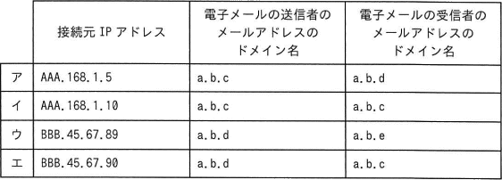
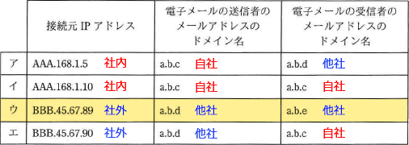

# [令和5年秋期 午前 問38](https://www.ap-siken.com/kakomon/05_aki/q38.html)

#問題 #テクノロジ #セキュリティ #情報セキュリティ対策

解説を表示解説を隠す

<strong>問38</strong>　自社の中継用メールサーバで，接続元IPアドレス，電子メールの送信者のメールアドレスのドメイン名，及び電子メールの受信者のメールアドレスのドメイン名から成るログを取得するとき，外部ネットワークからの第三者中継と判断できるログはどれか。ここで，AAA.168.1.5 と AAA.168.1.10 は自社のグローバルIPアドレスとし，BBB.45.67.89 と BBB.45.67.90 は社外のグローバルIPアドレスとする。a.b.c は自社のドメイン名とし，a.b.d と a.b.e は他社のドメイン名とする。また，IPアドレスとドメイン名は詐称されていないものとする。 

<ul class="ap-choices">
<li class="ap-choice-item ap-wrong">

ア

接続元<a href="用語/IPアドレス" class="internal-link" data-href="用語/IPアドレス">IPアドレス</a>、送信者の<a href="用語/ドメイン" class="internal-link" data-href="用語/ドメイン">ドメイン</a>名、受信者の<a href="用語/ドメイン" class="internal-link" data-href="用語/ドメイン">ドメイン</a>名のいずれかが自社に関係するため、<a href="用語/第三者中継" class="internal-link" data-href="用語/第三者中継">第三者中継</a>ではありません。組合せは選択肢表を参照してください。

</li>
<li class="ap-choice-item ap-wrong">

イ

接続元<a href="用語/IPアドレス" class="internal-link" data-href="用語/IPアドレス">IPアドレス</a>、送信者の<a href="用語/ドメイン" class="internal-link" data-href="用語/ドメイン">ドメイン</a>名、受信者の<a href="用語/ドメイン" class="internal-link" data-href="用語/ドメイン">ドメイン</a>名のいずれかが自社に関係するため、<a href="用語/第三者中継" class="internal-link" data-href="用語/第三者中継">第三者中継</a>ではありません。組合せは選択肢表を参照してください。

</li>
<li class="ap-choice-item ap-correct">

ウ

正しい。接続元<a href="用語/IPアドレス" class="internal-link" data-href="用語/IPアドレス">IPアドレス</a>、送信者の<a href="用語/ドメイン" class="internal-link" data-href="用語/ドメイン">ドメイン</a>名、受信者の<a href="用語/ドメイン" class="internal-link" data-href="用語/ドメイン">ドメイン</a>名がすべて自社と無関係です。

</li>
<li class="ap-choice-item ap-wrong">

エ

接続元<a href="用語/IPアドレス" class="internal-link" data-href="用語/IPアドレス">IPアドレス</a>、送信者の<a href="用語/ドメイン" class="internal-link" data-href="用語/ドメイン">ドメイン</a>名、受信者の<a href="用語/ドメイン" class="internal-link" data-href="用語/ドメイン">ドメイン</a>名のいずれかが自社に関係するため、<a href="用語/第三者中継" class="internal-link" data-href="用語/第三者中継">第三者中継</a>ではありません。組合せは選択肢表を参照してください。

</li>
</ul>

<h4>解説</h4>

<a href="用語/第三者中継" class="internal-link" data-href="用語/第三者中継">第三者中継</a>とは、メール<a href="用語/サーバ" class="internal-link" data-href="用語/サーバ">サーバ</a>が、本来行うべきではない外部ネットワークの第三者から別の第三者へのメール転送を中継してしまうことです。インターネットに公開されているメール<a href="用語/サーバ" class="internal-link" data-href="用語/サーバ">サーバ</a>が<a href="用語/第三者中継" class="internal-link" data-href="用語/第三者中継">第三者中継</a>を許す設定になっていると、スパムメールの温床になったり、スパムメールの発信・中継元としてブラックリストに載ってしまい、正規のメールの送受信に影響を与えるおそれがあります。

設問の条件に従って、各ログの<a href="用語/IPアドレス" class="internal-link" data-href="用語/IPアドレス">IPアドレス</a>と<a href="用語/ドメイン" class="internal-link" data-href="用語/ドメイン">ドメイン</a>名を分類すると以下のようになります。表に書き入れてみると一目瞭然で、接続元<a href="用語/IPアドレス" class="internal-link" data-href="用語/IPアドレス">IPアドレス</a>、<a href="用語/電子メール" class="internal-link" data-href="用語/電子メール">電子メール</a>の送信者の<a href="用語/ドメイン" class="internal-link" data-href="用語/ドメイン">ドメイン</a>名、<a href="用語/電子メール" class="internal-link" data-href="用語/電子メール">電子メール</a>の受信者の<a href="用語/ドメイン" class="internal-link" data-href="用語/ドメイン">ドメイン</a>名がすべて自社と無関係である「ウ」が<a href="用語/第三者中継" class="internal-link" data-href="用語/第三者中継">第三者中継</a>を示すログとわかります。

