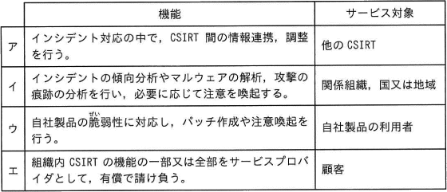
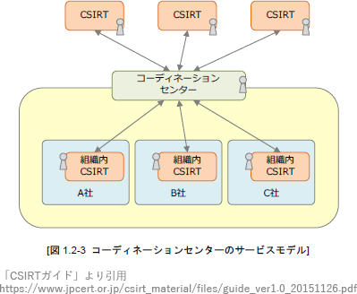

# [令和5年秋期 午前 問39](https://www.ap-siken.com/kakomon/05_aki/q39.html)

#問題 #テクノロジ #セキュリティ #情報セキュリティ管理

解説を表示解説を隠す

<strong>問39</strong>　JPCERTコーディネーションセンター"CSIRTガイド(2021年11月30日)" では，CSIRTを機能とサービス対象によって六つに分類しており，その一つにコーディネーションセンターがある。コーディネーションセンターの機能とサービス対象の組合せとして，適切なものはどれか。 

<ul class="ap-choices">
<li class="ap-choice-item ap-correct">

ア

正しい。コーディネーションセンターに該当します。

</li>
<li class="ap-choice-item ap-wrong">

イ

分析センターに該当します。

</li>
<li class="ap-choice-item ap-wrong">

ウ

ベンダーチーム（<a href="用語/PSIRT" class="internal-link" data-href="用語/PSIRT">PSIRT</a>）に該当します。

</li>
<li class="ap-choice-item ap-wrong">

エ

<a href="用語/インシデント" class="internal-link" data-href="用語/インシデント">インシデント</a>レスポンスプロバイダに該当します。

</li>
</ul>

<h4>解説</h4>

一般的に<a href="用語/CSIRT" class="internal-link" data-href="用語/CSIRT">CSIRT</a>といえば「組織内<a href="用語/CSIRT" class="internal-link" data-href="用語/CSIRT">CSIRT</a>」を指すことが多いのですが、広義の<a href="用語/CSIRT" class="internal-link" data-href="用語/CSIRT">CSIRT</a>は活動範囲の違いによって以下の6種類に分類されます。

<dl>
<dt>組織内<a href="用語/CSIRT" class="internal-link" data-href="用語/CSIRT">CSIRT</a></dt>
<dd>組織内のセキュリティ<a href="用語/インシデント" class="internal-link" data-href="用語/インシデント">インシデント</a>に対応する</dd>
<dt>国際連携<a href="用語/CSIRT" class="internal-link" data-href="用語/CSIRT">CSIRT</a></dt>
<dd>国を代表する形で<a href="用語/インシデント" class="internal-link" data-href="用語/インシデント">インシデント</a>対応のための連絡窓口として活動する</dd>
<dt>コーディネーションセンター</dt>
<dd>協力関係にある他の<a href="用語/CSIRT" class="internal-link" data-href="用語/CSIRT">CSIRT</a>との情報連携や調整を行う</dd>
<dt>分析センター</dt>
<dd><a href="用語/インシデント" class="internal-link" data-href="用語/インシデント">インシデント</a>の<a href="用語/傾向分析" class="internal-link" data-href="用語/傾向分析">傾向分析</a>、マルウェア解析、痕跡分析、注意喚起などを行う</dd>
<dt>ベンダーチーム（<a href="用語/PSIRT" class="internal-link" data-href="用語/PSIRT">PSIRT</a>）</dt>
<dd>自社製品の<a href="用語/脆弱性" class="internal-link" data-href="用語/脆弱性">脆弱性</a>に対応し、パッチを作成したり注意喚起をしたりする</dd>
<dt><a href="用語/インシデント" class="internal-link" data-href="用語/インシデント">インシデント</a>レスポンスプロバイダ</dt>
<dd>セキュリティベンダーや<a href="用語/SOC" class="internal-link" data-href="用語/SOC">SOC</a>(Security Operation Center)などの、<a href="用語/CSIRT" class="internal-link" data-href="用語/CSIRT">CSIRT</a>機能の一部を顧客から有償で請け負う事業者</dd>
</dl>

<a href="用語/CSIRT" class="internal-link" data-href="用語/CSIRT">CSIRT</a>ガイドではコーディネーションセンターについて「サービス対象は協力関係にある他の<a href="用語/CSIRT" class="internal-link" data-href="用語/CSIRT">CSIRT</a>。<a href="用語/インシデント" class="internal-link" data-href="用語/インシデント">インシデント</a>対応において<a href="用語/CSIRT" class="internal-link" data-href="用語/CSIRT">CSIRT</a>間の情報連携、調整を行なう。グループ企業間の連携を担当する」と説明しています。

したがって、サービス対象が「他の<a href="用語/CSIRT" class="internal-link" data-href="用語/CSIRT">CSIRT</a>」である「ア」が適切です。

