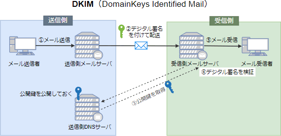

# [令和5年秋期 午前 問44](https://www.ap-siken.com/kakomon/05_aki/q44.html)

#問題 #テクノロジ #セキュリティ #セキュリティ実装技術

解説を表示解説を隠す

<strong>問44</strong>　DKIM(DomainKeys Identified Mail)に関する記述のうち，適切なものはどれか。

<ul class="ap-choices">
<li class="ap-choice-item ap-correct">

ア　送信側のメールサーバで電子メールにデジタル署名を付与し，受信側のメールサーバでそのデジタル署名を検証して送信元ドメインの認証を行う。

正しい。<a href="用語/DKIM" class="internal-link" data-href="用語/DKIM">DKIM</a>の説明です。送信側メールサーバが<a href="用語/ヘッダー" class="internal-link" data-href="用語/ヘッダー">ヘッダー</a>と本文から生成した<a href="用語/デジタル署名" class="internal-link" data-href="用語/デジタル署名">デジタル署名</a>を付加し、受信側が送信元<a href="用語/ドメイン" class="internal-link" data-href="用語/ドメイン">ドメイン</a>の<a href="用語/DNS" class="internal-link" data-href="用語/DNS">DNS</a>に登録された<a href="用語/公開鍵" class="internal-link" data-href="用語/公開鍵">公開鍵</a>で検証して正当なメールサーバからの送信であることを確認する仕組みです。

</li>
<li class="ap-choice-item ap-wrong">

イ　送信者が電子メールを送信するとき，送信側のメールサーバは，送信者が正規の利用者かどうかの認証を利用者IDとパスワードによって行う。

これは<a href="用語/SMTP-AUTH" class="internal-link" data-href="用語/SMTP-AUTH">SMTP-AUTH</a>の説明です。メール送信時に送信者本人の認証を行う仕組みであり、送信元<a href="用語/ドメイン" class="internal-link" data-href="用語/ドメイン">ドメイン</a>の認証とは別のものです。

</li>
<li class="ap-choice-item ap-wrong">

ウ　送信元ドメイン認証に失敗した際の電子メールの処理方法を記載したポリシーをDNSサーバに登録し、電子メールの認証結果を監視する。

これは<a href="用語/DMARC" class="internal-link" data-href="用語/DMARC">DMARC</a>(ディーマーク)の説明です。<a href="用語/SPF" class="internal-link" data-href="用語/SPF">SPF</a>や<a href="用語/DKIM" class="internal-link" data-href="用語/DKIM">DKIM</a>などの認証結果に応じた処理方針を<a href="用語/DNS" class="internal-link" data-href="用語/DNS">DNS</a>に登録し、レポートで監視する仕組みです。

</li>
<li class="ap-choice-item ap-wrong">

エ　電子メールの送信元ドメインでメール送信に使うメールサーバのIPアドレスをDNSサーバに登録しておき，受信側で送信元ドメインのDNSサーバに登録されているIPアドレスと電子メールの送信元メールサーバのIPアドレスとを照合する。

これは<a href="用語/SPF" class="internal-link" data-href="用語/SPF">SPF</a>(Sender Policy Framework)の説明です。送信元<a href="用語/ドメイン" class="internal-link" data-href="用語/ドメイン">ドメイン</a>が許可するメールサーバのIPアドレスを<a href="用語/DNS" class="internal-link" data-href="用語/DNS">DNS</a>に登録し、受信側で照合する仕組みです。

</li>
</ul>

<h4>解説</h4>

<a href="用語/DKIM" class="internal-link" data-href="用語/DKIM">DKIM</a>(DomainKeys Identified Mail)は、送信する電子メールの<a href="用語/ヘッダー" class="internal-link" data-href="用語/ヘッダー">ヘッダー</a>と本文から生成された<a href="用語/デジタル署名" class="internal-link" data-href="用語/デジタル署名">デジタル署名</a>を送信側メールサーバで付加し、受信側メールサーバが、送信側<a href="用語/ドメイン" class="internal-link" data-href="用語/ドメイン">ドメイン</a>の<a href="用語/DNS" class="internal-link" data-href="用語/DNS">DNS</a>サーバに登録されている<a href="用語/公開鍵" class="internal-link" data-href="用語/公開鍵">公開鍵</a>を使用して<a href="用語/デジタル署名" class="internal-link" data-href="用語/デジタル署名">デジタル署名</a>の検証を行うことで、正当なメールサーバから送られてきたメールであることを確認する仕組みです。スパムメール対策の技術のひとつとして利用されています。

イは<a href="用語/SMTP-AUTH" class="internal-link" data-href="用語/SMTP-AUTH">SMTP-AUTH</a>、ウは<a href="用語/DMARC" class="internal-link" data-href="用語/DMARC">DMARC</a>、エは<a href="用語/SPF" class="internal-link" data-href="用語/SPF">SPF</a>の説明であり、いずれもメールの送信元<a href="用語/ドメイン" class="internal-link" data-href="用語/ドメイン">ドメイン</a>認証や送信者認証に関する技術ですが、<a href="用語/DKIM" class="internal-link" data-href="用語/DKIM">DKIM</a>とは役割が異なります。

