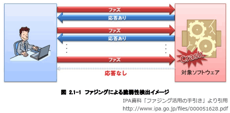

# [令和5年秋期 午前 問46](https://www.ap-siken.com/kakomon/05_aki/q46.html)

#問題 #テクノロジ #セキュリティ #セキュリティ技術評価

解説を表示解説を隠す

<strong>問46</strong>　問題を引き起こす可能性があるデータを大量に入力し，そのときの応答や挙動を監視することによって，ソフトウェアの脆弱性を検出するテスト手法はどれか。

<ul class="ap-choices">
<li class="ap-choice-item ap-wrong">

ア　限界値分析

これは限界値分析の説明です。問題が発生する可能性の高い限界値や境界値を入力して、問題が発生しないかどうかを検証する手法であり、不正データの大量投入による<a href="用語/脆弱性" class="internal-link" data-href="用語/脆弱性">脆弱性</a>検出とは異なります。

</li>
<li class="ap-choice-item ap-wrong">

イ　実験計画法

これは<a href="用語/実験計画法" class="internal-link" data-href="用語/実験計画法">実験計画法</a>の説明です。確認すべき複数の要因を組み合わせ、少ない実験回数で効率的に検証する手法であり、本問の大量入力による挙動監視とは目的が異なります。

</li>
<li class="ap-choice-item ap-correct">

ウ　ファジング

正しい。<a href="用語/ファジング" class="internal-link" data-href="用語/ファジング">ファジング</a>の説明です。様々な不正確なデータを入力として送り、ソフトウェアが意図しない動作をしないかどうか検証する手法です。

</li>
<li class="ap-choice-item ap-wrong">

エ　ロードテスト

これはロードテストの説明です。通常想定される運用条件下の高負荷をかけた状態でソフトウェアを動作させ、問題が発生しないかどうかを検証する手法であり、不正データによる<a href="用語/脆弱性" class="internal-link" data-href="用語/脆弱性">脆弱性</a>検出とは異なります。

</li>
</ul>

<h4>解説</h4>

<a href="用語/ファジング" class="internal-link" data-href="用語/ファジング">ファジング</a>(fuzzing)とは、検査対象のソフトウェア製品に「ファズ（英名：fuzz）」と呼ばれる問題を引き起こしそうなデータを大量に送り込み、その応答や挙動を監視することで(未知の)<a href="用語/脆弱性" class="internal-link" data-href="用語/脆弱性">脆弱性</a>を検出する検査手法です。

<a href="用語/ファジング" class="internal-link" data-href="用語/ファジング">ファジング</a>は、ファズデータの生成、検査対象への送信、挙動の監視を自動で行う<a href="用語/ファジング" class="internal-link" data-href="用語/ファジング">ファジング</a>ツール(ファザー)と呼ばれるソフトウェアを使用して行います。開発ライフサイクルに<a href="用語/ファジング" class="internal-link" data-href="用語/ファジング">ファジング</a>を導入することで「バグや<a href="用語/脆弱性" class="internal-link" data-href="用語/脆弱性">脆弱性</a>の低減」「テストの自動化・効率化によるコスト削減」が期待できるため、大手企業の一部で徐々に活用され始めています。

アは限界値分析、イは<a href="用語/実験計画法" class="internal-link" data-href="用語/実験計画法">実験計画法</a>、エはロードテストの説明であり、いずれもソフトウェアの検証手法ですが、本問が問う大量の問題データ投入と挙動監視による<a href="用語/脆弱性" class="internal-link" data-href="用語/脆弱性">脆弱性</a>検出とは異なります。

