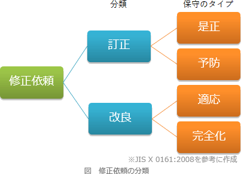

# [令和5年秋期 午前 問48](https://www.ap-siken.com/kakomon/05_aki/q48.html)

#問題 #テクノロジ #システム開発技術 #保守・廃棄

解説を表示解説を隠す

<strong>問48</strong>　問題は発生していないが，プログラムの仕様書と現状のソースコードとの不整合を解消するために，リバースエンジニアリングの手法を使って仕様書を作成し直す。これはソフトウェア保守のどの分類に該当するか。

<ul class="ap-choices">
<li class="ap-choice-item ap-correct">

ア　完全化保守

正しい。引渡し後のソフトウェア製品のパフォーマンスや<a href="用語/保守性" class="internal-link" data-href="用語/保守性">保守性</a>を向上させるための修正であり、プログラム文書の改善などを含む。

</li>
<li class="ap-choice-item ap-wrong">

イ　是正保守

これは<a href="用語/是正保守" class="internal-link" data-href="用語/是正保守">是正保守</a>の説明です。引渡し後に発見された問題を訂正するために行う受身の修正。

</li>
<li class="ap-choice-item ap-wrong">

ウ　適応保守

これは<a href="用語/適応保守" class="internal-link" data-href="用語/適応保守">適応保守</a>の説明です。変化した又は変化している環境において、ソフトウェア製品を使用できるように保ち続けるために実施する修正。

</li>
<li class="ap-choice-item ap-wrong">

エ　予防保守

これは<a href="用語/予防保守" class="internal-link" data-href="用語/予防保守">予防保守</a>の説明です。潜在的な障害が運用障害になる前に発見し、是正を行うための修正。

</li>
</ul>

<h4>解説</h4>

JIS X 0161によれば、システムやソフトウェアに対する保守は、その目的により、「訂正」の性質をもつ<a href="用語/是正保守" class="internal-link" data-href="用語/是正保守">是正保守</a>と<a href="用語/予防保守" class="internal-link" data-href="用語/予防保守">予防保守</a>、「改良」の性質をもつ<a href="用語/適応保守" class="internal-link" data-href="用語/適応保守">適応保守</a>と<a href="用語/完全化保守" class="internal-link" data-href="用語/完全化保守">完全化保守</a>の4つの類型に分けられます。

<ul>
<li><a href="用語/是正保守" class="internal-link" data-href="用語/是正保守">是正保守</a> … ソフトウェア製品の引渡し後に発見された問題を訂正するために行う受身の修正</li>
<li><a href="用語/予防保守" class="internal-link" data-href="用語/予防保守">予防保守</a> … 引渡し後のソフトウェア製品の潜在的な障害が運用障害になる前に発見し、是正を行うための修正</li>
<li><a href="用語/適応保守" class="internal-link" data-href="用語/適応保守">適応保守</a> … 引渡し後、変化した又は変化している環境において、ソフトウェア製品を使用できるように保ち続けるために実施する修正</li>
<li><a href="用語/完全化保守" class="internal-link" data-href="用語/完全化保守">完全化保守</a> … 引渡し後のソフトウェア製品のパフォーマンスや<a href="用語/保守性" class="internal-link" data-href="用語/保守性">保守性</a>を向上させるための修正。機能追加や変更、性能強化、プログラム文書の改善などを含む</li>
</ul>

設問の事例では、現状のソースコードに仕様書を合わせるための変更を行います。システム上の問題はありませんが、より完全な状態を目指して行われる保守ですので<a href="用語/完全化保守" class="internal-link" data-href="用語/完全化保守">完全化保守</a>に分類されます。したがって「ア」が正解です。

