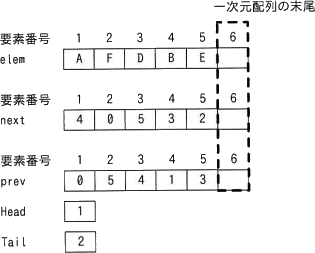
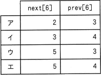
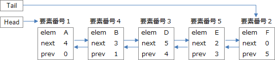
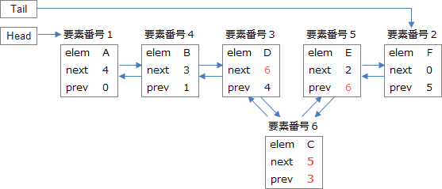

# [令和5年秋期 午前 問5](https://www.ap-siken.com/kakomon/05_aki/q5.html)

#問題 #テクノロジ #アルゴリズムとプログラミング #データ構造

解説を表示解説を隠す

<strong>問5</strong>　双方向リストを三つの一次元配列 elem[i]，next[i]，prev[i] の組で実現する。双方向リストが図の状態のとき，要素Dの次に要素Cを挿入した後の next[6]，prev[6] の値の組合せはどれか。ここで，双方向リストは次のように表現する。 ・双方向リストの要素は，elem[i]に値，next[i]に次の要素の要素番号，prev[i]に前の要素の要素番号を設定 ・双方向リストの先頭，末尾の要素番号は，それぞれ変数Head，Tailに設定 ・next[i]，prev[i]の値が0である要素は，それぞれ双方向リストの末尾，先頭を表す。 ・双方向リストへの要素の追加は，一次元配列の末尾に追加  

<ul class="ap-choices">
<li class="ap-choice-item ap-wrong">

ア

next[6]とprev[6]の組合せが誤っています。CはDとEの間に挿入されるので、next[6]にはEの要素番号5、prev[6]にはDの要素番号3を設定する必要があります。

</li>
<li class="ap-choice-item ap-wrong">

イ

next[6]とprev[6]の組合せが誤っています。CはDとEの間に挿入されるので、next[6]にはEの要素番号5、prev[6]にはDの要素番号3を設定する必要があります。

</li>
<li class="ap-choice-item ap-correct">

ウ

正しい。Cは一次元<a href="用語/配列" class="internal-link" data-href="用語/配列">配列</a>の末尾である要素番号6に追加され、next[6]=5（E）、prev[6]=3（D）となる。

</li>
<li class="ap-choice-item ap-wrong">

エ

next[6]とprev[6]の組合せが誤っています。CはDとEの間に挿入されるので、next[6]にはEの要素番号5、prev[6]にはDの要素番号3を設定する必要があります。

</li>
</ul>

<h4>解説</h4>

<a href="用語/双方向リスト" class="internal-link" data-href="用語/双方向リスト">双方向リスト</a>は、前の要素への参照と後ろの要素への参照を持ち、先頭からも末尾からも要素をたどることができる<a href="用語/リスト" class="internal-link" data-href="用語/リスト">リスト</a>構造です。

3つの<a href="用語/配列" class="internal-link" data-href="用語/配列">配列</a>を見ると、現在の<a href="用語/リスト" class="internal-link" data-href="用語/リスト">リスト</a>は先頭（Head）が要素番号1のA、2番目が要素番号4のB、同様にD、E、Fというように連結されていることがわかります。

Cは<a href="用語/リスト" class="internal-link" data-href="用語/リスト">リスト</a>上のDとEの間に挿入されるので、CのnextにはEが格納されている要素番号5、CのprevにはDが格納されている要素番号3を設定しなければなりません。Cは一次元<a href="用語/配列" class="internal-link" data-href="用語/配列">配列</a>の末尾である要素番号6に追加されるので、next[6] = 5、prev[6] = 3 となります。

したがって「ウ」の組合せが正解です。

