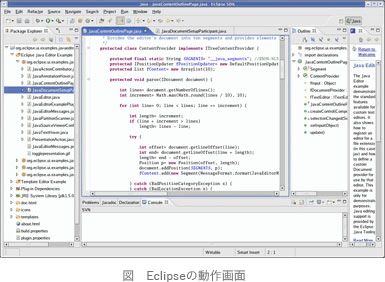

# [令和5年秋期 午前 問50](https://www.ap-siken.com/kakomon/05_aki/q50.html)

#問題 #テクノロジ #ソフトウェア開発管理技術 #開発プロセス・手法

解説を表示解説を隠す

<strong>問50</strong>　組込みシステムのソフトウェア開発に使われるIDEの説明として，適切なものはどれか。

<ul class="ap-choices">
<li class="ap-choice-item ap-correct">

ア　エディター，コンパイラ，リンカ，デバッガなどが一体となったツール

正しい。<a href="用語/IDE" class="internal-link" data-href="用語/IDE">IDE</a>（統合開発環境）の説明です。

</li>
<li class="ap-choice-item ap-wrong">

イ　専用のハードウェアインタフェースでCPUの情報を取得する装置

これはインサーキット<a href="用語/エミュレーター" class="internal-link" data-href="用語/エミュレーター">エミュレーター</a>（<a href="用語/ICE" class="internal-link" data-href="用語/ICE">ICE</a>）の説明です。ハードウェア上でソフトウェアの動作をエミュレートし、ハードウェアとソフトウェアの統合テストとデバッグを支援します。

</li>
<li class="ap-choice-item ap-wrong">

ウ　ターゲットCPUを搭載した評価ボードなどの実行環境

これはターゲットボードの説明です。実際のハードウェアを模倣し、ソフトウェアの実行とデバッグを実際のハードウェアで行うために使用されます。

</li>
<li class="ap-choice-item ap-wrong">

エ　タスクスケジューリングの仕組みなどを提供するソフトウェア

これは<a href="用語/リアルタイムOS" class="internal-link" data-href="用語/リアルタイムOS">リアルタイムOS</a>（RTOS）の説明です。

</li>
</ul>

<h4>解説</h4>

<a href="用語/IDE" class="internal-link" data-href="用語/IDE">IDE</a>（Integrated Development Environment）は、統合開発環境とも呼ばれ、エディター、<a href="用語/コンパイラ" class="internal-link" data-href="用語/コンパイラ">コンパイラ</a>、<a href="用語/リンカ" class="internal-link" data-href="用語/リンカ">リンカ</a>、<a href="用語/デバッガ" class="internal-link" data-href="用語/デバッガ">デバッガ</a>、<a href="用語/バージョン管理" class="internal-link" data-href="用語/バージョン管理">バージョン管理</a>などのソフトウェアの開発に必要なツールがまとめられ、ひとつの環境でコーディング、デバッグ、ビルドまでの一連の作業を行えるようにしたものです。<a href="用語/GUI" class="internal-link" data-href="用語/GUI">GUI</a>環境に対応したグラフィカルな開発環境を提供する製品がほとんどです。代表的なものとして、Java開発のEclipse、macOS/iOSアプリ開発のXcode、Androidアプリ開発のAndroid Studio、Microsoft Visual Studioなどがあります。

したがって「ア」の説明が適切です。

