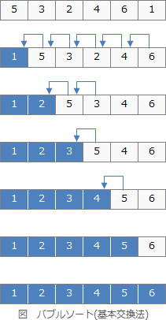
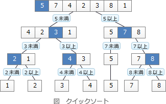
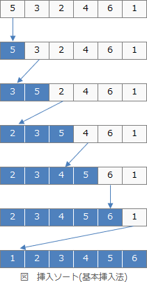

# [令和5年秋期 午前 問6](https://www.ap-siken.com/kakomon/05_aki/q6.html)

#問題 #テクノロジ #アルゴリズムとプログラミング #アルゴリズム

解説を表示解説を隠す

<strong>問6</strong>　あるデータ列を整列したら状態0から順に状態1，2，・・・，Nへと推移した。整列に使ったアルゴリズムはどれか。 状態0　3，5，9，6，1，2 状態1　3，5，6，1，2，9 状態2　3，5，1，2，6，9 ・ ・ 状態N　1，2，3，5，6，9

<ul class="ap-choices">
<li class="ap-choice-item ap-wrong">

ア　クイックソート

<a href="用語/クイックソート" class="internal-link" data-href="用語/クイックソート">クイックソート</a>は、整列対象のデータ群をある基準値以下のグループと基準値以上のグループに分割し、さらに分割後の各グループで基準値を選んで二つのグループに分割するという処理を繰り返してデータを整列する<a href="用語/アルゴリズム" class="internal-link" data-href="用語/アルゴリズム">アルゴリズム</a>です。状態の変化を見ても値の大小でグループ化されている様子がないので違う。

</li>
<li class="ap-choice-item ap-wrong">

イ　挿入ソート

<a href="用語/挿入ソート" class="internal-link" data-href="用語/挿入ソート">挿入ソート</a>は、未整列部分の先頭から要素を取り出し、取り出した要素を整列済み部分の順序関係を保つよう挿入することを繰り返して整列する<a href="用語/アルゴリズム" class="internal-link" data-href="用語/アルゴリズム">アルゴリズム</a>です。末尾から整列していく場合、末尾が[2]→[1, 2]→[1, 2, 6]と確定していくはずですが、状態1で9が末尾に移動していることから違う。

</li>
<li class="ap-choice-item ap-correct">

ウ　バブルソート

正しい。未整列データのうち最も大きい値を端に寄せることを繰り返しているので、<a href="用語/バブルソート" class="internal-link" data-href="用語/バブルソート">バブルソート</a>である。

</li>
<li class="ap-choice-item ap-wrong">

エ　ヒープソート

<a href="用語/ヒープソート" class="internal-link" data-href="用語/ヒープソート">ヒープソート</a>は、未整列データを「親の値≦子の値」(または「親の値≧子の値」)の関係をもつ<a href="用語/順序木" class="internal-link" data-href="用語/順序木">順序木</a>として表現し、整列後の根の値（最小値または最大値）を取り出すことを繰り返して整列を行う方法です。未整列データがヒープ木として表現されている様子がないので違う。

</li>
</ul>

<h4>解説</h4>

<a href="用語/バブルソート" class="internal-link" data-href="用語/バブルソート">バブルソート</a>(基本交換法)は、データ列中の隣り合った要素同士を比較し、順序が合っていなれば交換する操作を繰り返して整列する<a href="用語/アルゴリズム" class="internal-link" data-href="用語/アルゴリズム">アルゴリズム</a>です。1回の操作ごとに、未整列データのうち最大値または最小値が確定していきます。

状態0から状態1への1回目の整列で、最大値の"9"が正しい位置である末尾まで移動しています。そして、2回目の整列では、2番目に大きい"6"が末尾の一つ前に移動しています。データ列の端から順にひとつずつ確定していく流れから、<a href="用語/バブルソート" class="internal-link" data-href="用語/バブルソート">バブルソート</a>であるとわかります。

したがって「ウ」が正解です。

<a href="用語/クイックソート" class="internal-link" data-href="用語/クイックソート">クイックソート</a>は、整列対象のデータ群をある基準値以下のグループと基準値以上のグループに分割し、さらに分割後の各グループで基準値を選んで二つのグループに分割するという処理を繰り返してデータを整列する<a href="用語/アルゴリズム" class="internal-link" data-href="用語/アルゴリズム">アルゴリズム</a>です。状態の変化を見ても値の大小でグループ化されている様子がないので違うとわかります。 

<a href="用語/挿入ソート" class="internal-link" data-href="用語/挿入ソート">挿入ソート</a>は、未整列部分の先頭から要素を取り出し、取り出した要素を整列済み部分の順序関係を保つよう挿入することを繰り返して整列する<a href="用語/アルゴリズム" class="internal-link" data-href="用語/アルゴリズム">アルゴリズム</a>です。末尾から整列していく場合、末尾が[2]→[1, 2]→[1, 2, 6]と確定していくはずですが、状態1で9が末尾に移動していることから違うとわかります。 

