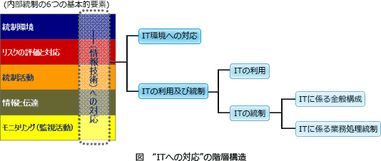
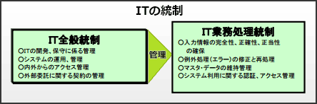

# [令和5年秋期 午前 問60](https://www.ap-siken.com/kakomon/05_aki/q60.html)

#問題 #マネジメント #システム監査 #内部統制

解説を表示解説を隠す

<strong>問60</strong>　金融庁"財務報告に係る内部統制の評価及び監査に関する実施基準(令和元年)"における"ITへの対応"に関する記述のうち，適切なものはどれか。

<ul class="ap-choices">
<li class="ap-choice-item ap-wrong">

ア　IT環境とは，企業内部に限られた範囲でのITの利用状況である。

IT環境は、組織が活動する上で必然的に関わる内外のITの利用状況（社会・市場におけるITの浸透度、取引におけるITの利用状況、組織が選択的に拠り所にしている一連の情報システムの状況等）をいう。企業内部に限られた範囲ではない。

</li>
<li class="ap-choice-item ap-correct">

イ　ITの統制は，ITに係る全般統制及びITに係る業務処理統制から成る。

正しい。ITの統制は、ITを取り入れた情報システムに関する統制活動であり、全般統制（複数の業務処理に関係する運用・管理などの方式や手続き）と業務処理統制（個々の業務プロセスに取り入れられたコントロール）の二つからなる。両者が一体となって機能することが重要とされている。

</li>
<li class="ap-choice-item ap-wrong">

ウ　ITの利用によって統制活動を自動化している場合，当該統制活動は有効であると評価される。

自動化により迅速な処理や人為的ミス防止などの利点はあるが、改ざんや不正使用があったときに検出しにくくなる問題点もある。そのことに留意して有効性を評価すべきであり、自動化しているだけでは有効と評価されない。

</li>
<li class="ap-choice-item ap-wrong">

エ　ITを利用せず手作業だけで内部統制を運用している場合，直ちに内部統制の不備となる。

ITを利用していないことが、直ちに<a href="用語/内部統制の不備" class="internal-link" data-href="用語/内部統制の不備">内部統制の不備</a>となるわけではない。ただし、手作業によるミスを別途防止するための管理策が講じられている必要がある。

</li>
</ul>

<h4>解説</h4>

"<a href="用語/ITへの対応" class="internal-link" data-href="用語/ITへの対応">ITへの対応</a>"は<a href="用語/内部統制" class="internal-link" data-href="用語/内部統制">内部統制</a>における6つの基本的要素の1つで、組織目標を達成するために予め適切な方針および手続を定め、それを踏まえて、業務の実施において組織の内外のITに対し適切に対応することをいいます。

参考URL: 財務報告に係る<a href="用語/内部統制" class="internal-link" data-href="用語/内部統制">内部統制</a>の評価および監査に関する実施基準(令和元年) https://www.fsa.go.jp/news/r1/sonota/20191213_naibutousei/1.pdf

正しい。ITの統制とは、ITを取り入れた情報システムに関する統制活動を意味し、全般統制と業務処理統制の二つからなります。全般統制は、複数の業務処理に関係する運用・管理などの方式や手続き、業務処理統制は、個々の業務プロセスに取り入れられたコントロールのことです。両者が一体となって機能することが重要とされています。 

