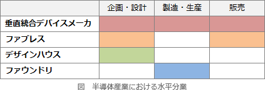

# [令和5年秋期 午前 問66](https://www.ap-siken.com/kakomon/05_aki/q66.html)

#問題 #ストラテジ #システム企画 #調達計画・実施

解説を表示解説を隠す

<strong>問66</strong>　半導体メーカーが行っているファウンドリーサービスの説明として，適切なものはどれか。

<ul class="ap-choices">
<li class="ap-choice-item ap-wrong">

ア　商号や商標の使用権とともに，一定地域内での商品の独占販売権を与える。

フランチャイザーの説明です。

</li>
<li class="ap-choice-item ap-wrong">

イ　自社で半導体製品の企画，設計から製造までを一貫して行い，それを自社ブランドで販売する。

垂直統合型デバイスメーカー(IDM：Integrated Device Manufacturer)の説明です。

</li>
<li class="ap-choice-item ap-wrong">

ウ　製造設備をもたず，半導体製品の企画，設計及び開発を専門に行う。

<a href="用語/ファブレス" class="internal-link" data-href="用語/ファブレス">ファブレス</a>企業の説明です。

</li>
<li class="ap-choice-item ap-correct">

エ　他社からの製造委託を受けて，半導体製品の製造を行う。

正しい。<a href="用語/ファウンドリ" class="internal-link" data-href="用語/ファウンドリ">ファウンドリ</a>ーサービスの説明です。

</li>
</ul>

<h4>解説</h4>

<a href="用語/ファウンドリ" class="internal-link" data-href="用語/ファウンドリ">ファウンドリ</a>ーサービスとは、半導体の生産設備を保有し、他社から半導体の製造を受託する会社です。半導体の製造だけを専門的に行い、自ら回路設計を行うことはしません。

製造プロセスの微細化が進む半導体業界では、会社ごとに工場を持ってその都度対応するための投資を続けるより、他社に製造委託してしまった方が結果的にコストを抑えることができるため、このような垂直分業が発展しています。

したがって、半導体の製造だけを専門に行う「エ」が<a href="用語/ファウンドリ" class="internal-link" data-href="用語/ファウンドリ">ファウンドリ</a>ーサービスの説明です。

