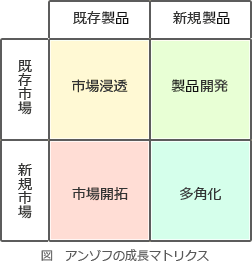

# [令和5年秋期 午前 問67](https://www.ap-siken.com/kakomon/05_aki/q67.html)

#問題 #ストラテジ #経営戦略マネジメント #経営戦略手法

解説を表示解説を隠す

<strong>問67</strong>　H.I.アンゾフが提唱した成長マトリクスを説明したものはどれか。

<ul class="ap-choices">
<li class="ap-choice-item ap-correct">

ア　既存製品か新製品かという製品軸と既存市場か新市場かという市場軸の両軸で捉え、事業成長戦略を考える。

正しい。成長マトリクス（<a href="用語/製品・市場マトリクス" class="internal-link" data-href="用語/製品・市場マトリクス">製品・市場マトリクス</a>）は、製品軸と市場軸の両軸で事業成長戦略を検討するフレームワークです。

</li>
<li class="ap-choice-item ap-wrong">

イ　コストで優位に立つかコスト以外で差別化するか，ターゲットを広くするか集中するかによって戦略を考える。

ポーターの<a href="用語/競争戦略" class="internal-link" data-href="用語/競争戦略">競争戦略</a>の説明です。

</li>
<li class="ap-choice-item ap-wrong">

ウ　市場成長率が高いか低いか，相対的市場シェアが大きいか小さいかによって事業を捉え，資源配分の戦略を考える。

プロダクトポートフォリオマネジメント分析の説明です。

</li>
<li class="ap-choice-item ap-wrong">

エ　自社の内部環境の強みと弱み，取り巻く外部環境の機会と脅威を抽出し，取組方針を整理して戦略を考える。

SWOT分析の説明です。

</li>
</ul>

<h4>解説</h4>

アンゾフの成長マトリクスは、経営学者のH・イゴール・アンゾフ（H. Igor Ansoff）が提唱したもので、縦軸に「市場」、横軸に「製品」をとり、それぞれに「既存」「新規」の2区分を設け、4象限（市場浸透、製品開発、市場開拓、<a href="用語/多角化" class="internal-link" data-href="用語/多角化">多角化</a>）のマトリクスとしたものです。事業が成長・発展できる経営戦略を検討するために適したフレームワークです。

