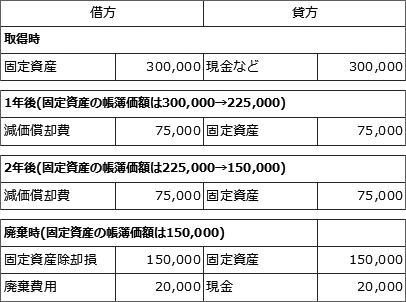

# [令和5年秋期 午前 問77](https://www.ap-siken.com/kakomon/05_aki/q77.html)

#問題 #ストラテジ #企業活動 #会計・財務

解説を表示解説を隠す

<strong>問77</strong>　取得原価30万円のPCを2年間使用した後，廃棄処分し，廃棄費用2万円を現金で支払った。このときの固定資産の除却損は廃棄費用も含めて何万円か。ここで，耐用年数は4年，減価償却は定額法，定額法の償却率は0.250，残存価額は0円とする。

<ul class="ap-choices">
<li class="ap-choice-item ap-wrong">

ア　9.5

帳簿価額と廃棄<a href="用語/費用" class="internal-link" data-href="用語/費用">費用</a>から求まる除却損ではありません。

</li>
<li class="ap-choice-item ap-wrong">

イ　13.0

帳簿価額と廃棄<a href="用語/費用" class="internal-link" data-href="用語/費用">費用</a>から求まる除却損ではありません。

</li>
<li class="ap-choice-item ap-wrong">

ウ　15.0

2年使用後の帳簿価額のみで、廃棄<a href="用語/費用" class="internal-link" data-href="用語/費用">費用</a>2万円を除却損に含めていません。

</li>
<li class="ap-choice-item ap-correct">

エ　17.0

正しい。帳簿価額15万円に廃棄<a href="用語/費用" class="internal-link" data-href="用語/費用">費用</a>2万円を加えた17万円です。

</li>
</ul>

<h4>解説</h4>

<a href="用語/減価償却" class="internal-link" data-href="用語/減価償却">減価償却</a>は、企業会計における「<a href="用語/費用" class="internal-link" data-href="用語/費用">費用</a>収益対応の原則」に基づき、<a href="用語/固定資産" class="internal-link" data-href="用語/固定資産">固定資産</a>の取得費を使用期間（耐用年数）にわたって<a href="用語/費用" class="internal-link" data-href="用語/費用">費用</a>として分配する手続きです。毎年期末に<a href="用語/減価償却" class="internal-link" data-href="用語/減価償却">減価償却</a>費を<a href="用語/費用" class="internal-link" data-href="用語/費用">費用</a>として計上し、<a href="用語/固定資産" class="internal-link" data-href="用語/固定資産">固定資産</a>の帳簿価額は<a href="用語/減価償却" class="internal-link" data-href="用語/減価償却">減価償却</a>費の分だけ減ることになります。

<a href="用語/減価償却" class="internal-link" data-href="用語/減価償却">減価償却</a>の方法は定額法なので、取得価額に償却率を乗じた額が1年当たりの償却額となります。本問では、取得価額が30万円で償却率は0.250なので、1年当たりの償却額は、 300,000円×0.250＝75,000円 この額を毎年の期末に、<a href="用語/固定資産" class="internal-link" data-href="用語/固定資産">固定資産</a>の帳簿価額から差し引いていくため、<a href="用語/固定資産" class="internal-link" data-href="用語/固定資産">固定資産</a>の取得から2年後の帳簿価額は、 300,000円－(75,000円×2)＝150,000円 帳簿価額が15万円の<a href="用語/固定資産" class="internal-link" data-href="用語/固定資産">固定資産</a>を廃棄処分するので、除却損は15万円と廃棄<a href="用語/費用" class="internal-link" data-href="用語/費用">費用</a>2万円を合計した17万円になります。したがって「エ」が正解です。

下図は、帳簿価額の変化を仕訳の流れとともに表したものです。 

