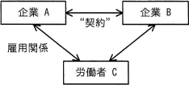
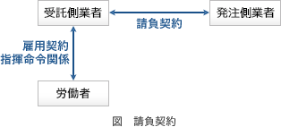
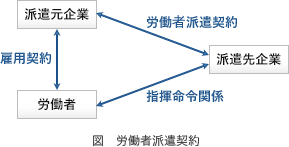
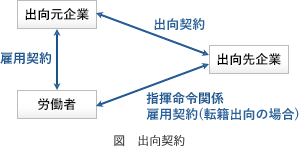

# [令和5年秋期 午前 問80](https://www.ap-siken.com/kakomon/05_aki/q80.html)

#問題 #ストラテジ #法務 #労働関連・取引関連法規

解説を表示解説を隠す

<strong>問80</strong>　図は，企業と労働者の関係を表している。企業Bと労働者Cの関係を表す記述として正しいものはどれか。 

<ul class="ap-choices">
<li class="ap-choice-item ap-wrong">

ア　"契約"が請負契約で，企業Aが受託者，企業Bが委託者であるとき，企業Bと労働者Cとの間には，指揮命令関係が生じる。

契約が<a href="用語/請負契約" class="internal-link" data-href="用語/請負契約">請負契約</a>ならば、<a href="用語/指揮命令" class="internal-link" data-href="用語/指揮命令">指揮命令</a>関係が生じるのは受託者である企業Aと労働者Cの間です。

</li>
<li class="ap-choice-item ap-correct">

イ　"契約"が出向にかかわる契約で，企業Aが企業Bに労働者Cを出向させたとき，企業Bと労働者Cとの間には指揮命令関係が生じる。

正しい。契約が出向契約ならば、出向先である企業Bと労働者Cの間に<a href="用語/指揮命令" class="internal-link" data-href="用語/指揮命令">指揮命令</a>関係が生じます。

</li>
<li class="ap-choice-item ap-wrong">

ウ　"契約"が労働者派遣契約で，企業Aが派遣元，企業Bが派遣先であるとき，企業Bと労働者Cの間にも，雇用関係が生じる。

契約が<a href="用語/労働者派遣契約" class="internal-link" data-href="用語/労働者派遣契約">労働者派遣契約</a>ならば、雇用関係が生じるのは派遣元である企業Aと労働者Cの間のみです。

</li>
<li class="ap-choice-item ap-wrong">

エ　"契約"が労働者派遣契約で，企業Aが派遣元，企業Bが派遣先であるとき，企業Bに労働者Cが出向しているといえる。

<a href="用語/労働者派遣契約" class="internal-link" data-href="用語/労働者派遣契約">労働者派遣契約</a>と出向は異なります。契約が<a href="用語/労働者派遣契約" class="internal-link" data-href="用語/労働者派遣契約">労働者派遣契約</a>ならば、労働者Cは派遣契約に基づき企業Bに派遣されていることになります。

</li>
</ul>

<h4>解説</h4>

<a href="用語/請負契約" class="internal-link" data-href="用語/請負契約">請負契約</a>、<a href="用語/労働者派遣契約" class="internal-link" data-href="用語/労働者派遣契約">労働者派遣契約</a>および出向契約は、次のような労働契約です。

<strong><a href="用語/請負契約" class="internal-link" data-href="用語/請負契約">請負契約</a></strong>　受託者がある仕事を完成することを約束し、委託者がその仕事の結果に対してその報酬を支払うことを内容とする労務供給契約の一種。<a href="用語/雇用契約" class="internal-link" data-href="用語/雇用契約">雇用契約</a>、<a href="用語/指揮命令" class="internal-link" data-href="用語/指揮命令">指揮命令</a>関係ともに受託側企業と労働者の間にあります。

<strong><a href="用語/労働者派遣契約" class="internal-link" data-href="用語/労働者派遣契約">労働者派遣契約</a></strong>　受託側企業の社員が委託側企業の<a href="用語/指揮命令" class="internal-link" data-href="用語/指揮命令">指揮命令</a>で働くことができるようにした労務供給契約。<a href="用語/雇用契約" class="internal-link" data-href="用語/雇用契約">雇用契約</a>は受託企業と労働者の間、<a href="用語/指揮命令" class="internal-link" data-href="用語/指揮命令">指揮命令</a>関係は委託側企業と労働者の間にあります。

<strong>出向契約</strong>　元の会社との雇用関係および身分を存続させたまま、長期間にわたり出向先企業の管理および<a href="用語/指揮命令" class="internal-link" data-href="用語/指揮命令">指揮命令</a>下で勤務する契約。派遣契約との相違は、人材の育成・援助・交流などを目的としてグループ企業間で行われる点。転籍出向と在籍出向がある。

