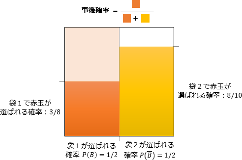

# [令和6年春期 午前 問1](https://www.ap-siken.com/kakomon/06_haru/q1.html)

#問題 #テクノロジ #基礎理論 #応用数学

解説を表示解説を隠す

<strong>問1</strong>　複数の袋からそれぞれ白と赤の玉を幾つかずつ取り出すとき，ベイズの定理を利用して事後確率を求める場合はどれか。

<ul class="ap-choices">
<li class="ap-choice-item ap-wrong">

ア　ある袋から取り出した二つの玉の色が同じと推定することができる確率を求める場合

結果（玉の色）から原因（どの袋か）を逆算するのではなく、ある袋から2個取ったときの組合せ確率を求める類型。

</li>
<li class="ap-choice-item ap-wrong">

イ　異なる袋から取り出した玉が同じ色であると推定することができる確率を求める場合

袋をまたいだ2個の色の一致確率であり、観測結果から袋を特定する事後確率の問題ではない。

</li>
<li class="ap-choice-item ap-wrong">

ウ　玉を一つ取り出すために，ある袋が選ばれると推定することができる確率を求める場合

取り出し前の袋選択（事前）の確率であり、取り出した玉の色という結果を得たあとに袋を<a href="用語/推定" class="internal-link" data-href="用語/推定">推定</a>する設定ではない。

</li>
<li class="ap-choice-item ap-correct">

エ　取り出した玉の色から，どの袋から取り出されたのかを推定するための確率を求める場合

正しい。結果（玉の色）から原因（袋）を<a href="用語/推定" class="internal-link" data-href="用語/推定">推定</a>する事後確率の典型例。

</li>
</ul>

<h4>解説</h4>

<a href="用語/ベイズの定理" class="internal-link" data-href="用語/ベイズの定理">ベイズの定理</a>は、ある条件付確率の結果を基にして、その事象が前提とする条件が起こっていた確率（事後確率）を計算するために使用される次の式です。

P(B|A)＝P(A|B)×P(B)P(A)

<ul>
<li>P(A|B)　Bが起きたという条件の下でAが起こる確率：事後確率</li>
<li>P(B|A)　Aが起きたという条件の下でBが起こる確率：<a href="用語/尤度" class="internal-link" data-href="用語/尤度">尤度</a>(ゆうど)</li>
<li>P(B)　Bが起こる確率：事前確率</li>
<li>P(A)　Aが起こる確率：周辺<a href="用語/尤度" class="internal-link" data-href="用語/尤度">尤度</a></li>
</ul>

式の意味を言葉で表すと以下のとおりです。

P(原因|結果)＝P(結果|原因)×P(原因)P(結果)

例えば袋が2つあり、袋1には白玉5つと赤玉3つ、袋2には白玉2つと赤玉8つが入っているとします。2つの袋のどちらが選ばれるかは同様に確からしいとすると、玉を1つ取り出しそれが赤玉だった場合、

<ul>
<li>P(B|A)　袋1が選ばれ赤玉が取り出される確率：1／2×3／8＝3／16</li>
<li>P(B)　袋1が選ばれる確率：1／2</li>
<li>P(A)　赤玉が取り出される確率：1／2×3／8＋1／2×8／10</li>
</ul>

なので、袋1から取り出された確率 P(袋1|赤玉) は、

P(袋1|赤玉)＝3／8×1／21／2×3／8＋1／2×8／10 ＝3／163／16＋4／10＝3／1647／80＝15／47

逆に袋2から選ばれた確率 P(袋2|赤玉) は、1－15／47＝32／47

このように結果データから原因が起こった確率を求めることができるのが<a href="用語/ベイズの定理" class="internal-link" data-href="用語/ベイズの定理">ベイズの定理</a>です。<a href="用語/ベイズの定理" class="internal-link" data-href="用語/ベイズの定理">ベイズの定理</a>は、<a href="用語/機械学習" class="internal-link" data-href="用語/機械学習">機械学習</a>やデータサイエンスにおける多くの<a href="用語/アルゴリズム" class="internal-link" data-href="用語/アルゴリズム">アルゴリズム</a>や手法の基礎となっています。したがって「エ」が正解となります。

