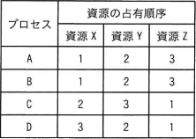
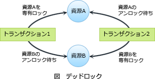

# [令和6年春期 午前 問17](https://www.ap-siken.com/kakomon/06_haru/q17.html)

#問題 #テクノロジ #ソフトウェア #オペレーティングシステム

解説を表示解説を隠す

<strong>問17</strong>　三つの資源X～Zを占有して処理を行う四つのプロセスA～Dがある。各プロセスは処理の進行に伴い，表中の数値の順に資源を占有し，実行終了時に三つの資源を一括して解放する。プロセスAと同時にもう一つプロセスを動かした場合に，デッドロックを起こす可能性のあるプロセスはどれか。 

<ul class="ap-choices">
<li class="ap-choice-item ap-wrong">

ア　B，C，D

誤り。<a href="用語/プロセス" class="internal-link" data-href="用語/プロセス">プロセス</a>Bは<a href="用語/プロセス" class="internal-link" data-href="用語/プロセス">プロセス</a>Aと占有順序が同じため，<a href="用語/デッドロック" class="internal-link" data-href="用語/デッドロック">デッドロック</a>は発生しません。

</li>
<li class="ap-choice-item ap-correct">

イ　C，D

正しい。<a href="用語/プロセス" class="internal-link" data-href="用語/プロセス">プロセス</a>C，Dは<a href="用語/プロセス" class="internal-link" data-href="用語/プロセス">プロセス</a>Aと占有順序が異なるため，<a href="用語/デッドロック" class="internal-link" data-href="用語/デッドロック">デッドロック</a>が発生する可能性があります。

</li>
<li class="ap-choice-item ap-wrong">

ウ　Cだけ

誤り。<a href="用語/プロセス" class="internal-link" data-href="用語/プロセス">プロセス</a>Dも<a href="用語/プロセス" class="internal-link" data-href="用語/プロセス">プロセス</a>Aと占有順序が異なるため，<a href="用語/デッドロック" class="internal-link" data-href="用語/デッドロック">デッドロック</a>が発生する可能性があります。

</li>
<li class="ap-choice-item ap-wrong">

エ　Dだけ

誤り。<a href="用語/プロセス" class="internal-link" data-href="用語/プロセス">プロセス</a>Cも<a href="用語/プロセス" class="internal-link" data-href="用語/プロセス">プロセス</a>Aと占有順序が異なるため，<a href="用語/デッドロック" class="internal-link" data-href="用語/デッドロック">デッドロック</a>が発生する可能性があります。

</li>
</ul>

<h4>解説</h4>

<a href="用語/デッドロック" class="internal-link" data-href="用語/デッドロック">デッドロック</a>とは、共有<a href="用語/資源" class="internal-link" data-href="用語/資源">資源</a>を使用する2つ以上の<a href="用語/プロセス" class="internal-link" data-href="用語/プロセス">プロセス</a>が、互いに相手<a href="用語/プロセス" class="internal-link" data-href="用語/プロセス">プロセス</a>が必要とする<a href="用語/資源" class="internal-link" data-href="用語/資源">資源</a>を排他的に使用していて、互いの<a href="用語/プロセス" class="internal-link" data-href="用語/プロセス">プロセス</a>が相手が使用している<a href="用語/資源" class="internal-link" data-href="用語/資源">資源</a>の解放を待っている状態です。<a href="用語/デッドロック" class="internal-link" data-href="用語/デッドロック">デッドロック</a>が発生すると、両方の<a href="用語/プロセス" class="internal-link" data-href="用語/プロセス">プロセス</a>が永久的な待ち状態に陥ってしまうため、処理の続行ができなくなってしまいます。

<a href="用語/デッドロック" class="internal-link" data-href="用語/デッドロック">デッドロック</a>は、<a href="用語/資源" class="internal-link" data-href="用語/資源">資源</a>の占有順序が異なる場合に発生する可能性があります。

<strong>［<a href="用語/プロセス" class="internal-link" data-href="用語/プロセス">プロセス</a>B］</strong> 占有順序が<a href="用語/プロセス" class="internal-link" data-href="用語/プロセス">プロセス</a>Aと同じなので<a href="用語/デッドロック" class="internal-link" data-href="用語/デッドロック">デッドロック</a>は発生しません。 <a href="用語/プロセス" class="internal-link" data-href="用語/プロセス">プロセス</a>Aが<a href="用語/資源" class="internal-link" data-href="用語/資源">資源</a>X，Y，Zを使用している間、<a href="用語/プロセス" class="internal-link" data-href="用語/プロセス">プロセス</a>Bは<a href="用語/資源" class="internal-link" data-href="用語/資源">資源</a>の解放を待ち、<a href="用語/プロセス" class="internal-link" data-href="用語/プロセス">プロセス</a>Aの実行終了後に処理を開始します。

<strong>［<a href="用語/プロセス" class="internal-link" data-href="用語/プロセス">プロセス</a>C］</strong> 占有順序が<a href="用語/プロセス" class="internal-link" data-href="用語/プロセス">プロセス</a>Aと異なるので、以下の順序の場合に<a href="用語/デッドロック" class="internal-link" data-href="用語/デッドロック">デッドロック</a>が発生します。

<ol>
<li><a href="用語/プロセス" class="internal-link" data-href="用語/プロセス">プロセス</a>Aが<a href="用語/資源" class="internal-link" data-href="用語/資源">資源</a>Xを占有</li>
<li><a href="用語/プロセス" class="internal-link" data-href="用語/プロセス">プロセス</a>Cが<a href="用語/資源" class="internal-link" data-href="用語/資源">資源</a>Zを占有</li>
<li><a href="用語/プロセス" class="internal-link" data-href="用語/プロセス">プロセス</a>Aが<a href="用語/資源" class="internal-link" data-href="用語/資源">資源</a>Yを占有</li>
<li><a href="用語/プロセス" class="internal-link" data-href="用語/プロセス">プロセス</a>Cは<a href="用語/資源" class="internal-link" data-href="用語/資源">資源</a>Xの解放待ち&amp;<a href="用語/プロセス" class="internal-link" data-href="用語/プロセス">プロセス</a>Aは<a href="用語/資源" class="internal-link" data-href="用語/資源">資源</a>Zの解放待ち</li>
<li><a href="用語/デッドロック" class="internal-link" data-href="用語/デッドロック">デッドロック</a>の発生</li>
</ol>

<strong>［<a href="用語/プロセス" class="internal-link" data-href="用語/プロセス">プロセス</a>D］</strong> 占有順序が<a href="用語/プロセス" class="internal-link" data-href="用語/プロセス">プロセス</a>Aと異なるので、以下の順序の場合に<a href="用語/デッドロック" class="internal-link" data-href="用語/デッドロック">デッドロック</a>が発生します。

<ol>
<li><a href="用語/プロセス" class="internal-link" data-href="用語/プロセス">プロセス</a>Aが<a href="用語/資源" class="internal-link" data-href="用語/資源">資源</a>Xを占有</li>
<li><a href="用語/プロセス" class="internal-link" data-href="用語/プロセス">プロセス</a>Dが<a href="用語/資源" class="internal-link" data-href="用語/資源">資源</a>Zを占有</li>
<li><a href="用語/プロセス" class="internal-link" data-href="用語/プロセス">プロセス</a>Aが<a href="用語/資源" class="internal-link" data-href="用語/資源">資源</a>Yを占有</li>
<li><a href="用語/プロセス" class="internal-link" data-href="用語/プロセス">プロセス</a>Dは<a href="用語/資源" class="internal-link" data-href="用語/資源">資源</a>Yの解放待ち&amp;<a href="用語/プロセス" class="internal-link" data-href="用語/プロセス">プロセス</a>Aは<a href="用語/資源" class="internal-link" data-href="用語/資源">資源</a>Zの解放待ち</li>
<li><a href="用語/デッドロック" class="internal-link" data-href="用語/デッドロック">デッドロック</a>の発生</li>
</ol>

したがって、<a href="用語/プロセス" class="internal-link" data-href="用語/プロセス">プロセス</a>Aと<a href="用語/デッドロック" class="internal-link" data-href="用語/デッドロック">デッドロック</a>が発生する可能性のある<a href="用語/プロセス" class="internal-link" data-href="用語/プロセス">プロセス</a>は「C，D」です。

