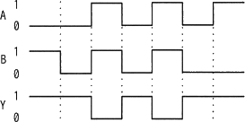
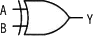
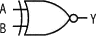
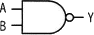
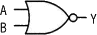
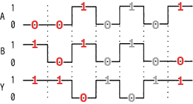

# [令和6年春期 午前 問21](https://www.ap-siken.com/kakomon/06_haru/q21.html)

#問題 #テクノロジ #ハードウェア
<!-- ap-siken「分類」→ タグ一覧.md で実タグに置換（#大分類=#テクノロジ 等。中・小は分類の中段・末段） -->

解説を表示解説を隠す

<strong>問21</strong>　入力がAとB，出力がYの論理回路を動作させたとき，図のタイムチャートが得られた。この論理回路として，適切なものはどれか。[画像] 

<ul class="ap-choices">
<li class="ap-choice-item ap-wrong">

ア　

<a href="用語/排他的論理和" class="internal-link" data-href="用語/排他的論理和">排他的論理和</a>（XOR）は2つの入力が異なるときに1を出力するが，本問のタイムチャートはA=0,B=0でもY=1となっており一致しない。

</li>
<li class="ap-choice-item ap-wrong">

イ　

論理一致（XNOR）は2つの入力が等しいときに1を出力するが，本問のタイムチャートではA=1,B=0でもY=1となっており一致しない。

</li>
<li class="ap-choice-item ap-correct">

ウ　

正しい。タイムチャートから読み取れる入出力関係は，A=1,B=1のときだけY=0で，それ以外はY=1となる。これはNAND（<a href="用語/否定論理積" class="internal-link" data-href="用語/否定論理積">否定論理積</a>）の動作に一致する。

</li>
<li class="ap-choice-item ap-wrong">

エ　

<a href="用語/否定論理和" class="internal-link" data-href="用語/否定論理和">否定論理和</a>（NOR）はA=0,B=0のときだけ1を出力するが，本問のタイムチャートではA=0,B=1でもY=1となっており一致しない。

</li>
</ul>

<h4>解説</h4>

タイムチャートをビットの変化ごとに区切って見ていくと、次の関係を読み取ることができる。

<ul>
<li>A=0、B=1、出力Y=1</li>
<li>A=0、B=0、出力Y=1</li>
<li>A=1、B=1、出力Y=0</li>
<li>A=1、B=0、出力Y=1</li>
</ul>

これを<a href="用語/真理値表" class="internal-link" data-href="用語/真理値表">真理値表</a>として入力の順に整理すると次のようになる。

<ul>
<li>A=0、B=0、出力Y=1</li>
<li>A=0、B=1、出力Y=1</li>
<li>A=1、B=0、出力Y=1</li>
<li>A=1、B=1、出力Y=0</li>
</ul>

2つの入力がともに1の場合にだけ0を出力し、それ以外の場合には1を出力するのは<a href="用語/NAND回路" class="internal-link" data-href="用語/NAND回路">NAND回路</a>である。NANDは Not AND の意なので「否定＋<a href="用語/論理積" class="internal-link" data-href="用語/論理積">論理積</a>」である「ウ」が正解となる。

