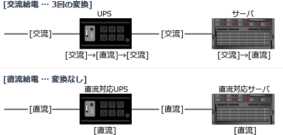

# [R6春期 午前 問23](https://www.ap-siken.com/kakomon/06_haru/q23.html)

#問題 #テクノロジ #ハードウェア

解説を表示解説を隠す

<strong>問23</strong>　データセンターなどで採用されているサーバ，ネットワーク機器に対する直流給電の利点として，適切なものはどれか。

<ul class="ap-choices">
<li class="ap-choice-item ap-correct">

ア　交流から直流への変換，直流から交流への変換で生じる電力損失を低減できる。

正しい。直流と交流の変換回数を少なくすることで、変換で生じる電力損失を低減できるのが利点です。

</li>
<li class="ap-choice-item ap-wrong">

イ　受電設備からCPUなどのLSIまで，同じ電圧のまま給電できる。

<a href="用語/CPU" class="internal-link" data-href="用語/CPU">CPU</a>や<a href="用語/LSI" class="internal-link" data-href="用語/LSI">LSI</a>は低電圧で動作するので、降圧が必要になります。

</li>
<li class="ap-choice-item ap-wrong">

ウ　停電の危険がないので，電源バックアップ用のバッテリを不要にできる。

停電を防止できるわけではありません。

</li>
<li class="ap-choice-item ap-wrong">

エ　トランスを用いて容易に昇圧，降圧ができる。

交流では<a href="用語/トランス" class="internal-link" data-href="用語/トランス">トランス</a>(変圧器)を使用することで自在に昇圧・降圧できますが、直流の変圧には手間が掛かります。

</li>
</ul>

<h4>解説</h4>

直流給電とは、屋内配線を直流化し、電気製品への電源供給を直流で行うことです。

<a href="用語/サーバ" class="internal-link" data-href="用語/サーバ">サーバ</a>やネットワーク機器などのコンピュータをはじめ、家庭内のほとんどの電気製品は直流電源で動作しています。一方、家庭やオフィスでは交流電源が供給されています。電気機器は、内部のコンバータで交流を直流に変換するのですが、この変換効率は80%程度しかありません。もしそのまま直流で給電できれば、変換による電力の損失を低減できることになります。

データセンターでは大量の電力を必要とする上、電源の瞬断に備えて<a href="用語/UPS" class="internal-link" data-href="用語/UPS">UPS</a>が設置されています。<a href="用語/UPS" class="internal-link" data-href="用語/UPS">UPS</a>は直流で蓄電するので交流と直流の変換回数はさらに多くなります。データセンターが直流給電を採用するのには、無駄な電力ロスを抑える目的があります。

