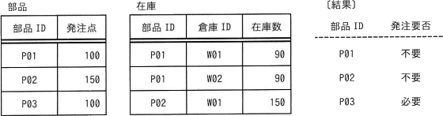
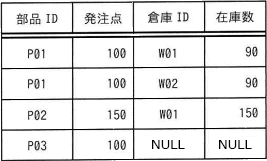
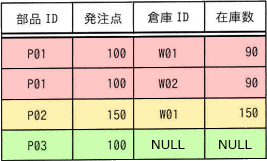

# [令和6年春期 午前 問26](https://www.ap-siken.com/kakomon/06_haru/q26.html)

#問題 #テクノロジ #データベース #データ操作

解説を表示解説を隠す

<strong>問26</strong>　"部品"表及び"在庫"表に対し，SQL文を実行して結果を得た。SQL文のaに入れる字句はどれか。 〔SQL文〕 SELECT 部品.部品ID AS 部品ID， CASE WHEN 部品.発注点 &gt; a THEN N'必要' ELSE N'不要' END AS 発注要否 FROM 部品 LEFT OUTER JOIN 在庫 ON 部品.部品ID = 在庫.部品ID GROUP BY 部品.部品ID，部品.発注点 

<ul class="ap-choices">
<li class="ap-choice-item ap-wrong">

ア　COALESCE(MIN(在庫.在庫数)，0)

MINはグループ内の最小値を返すため，<a href="用語/部品" class="internal-link" data-href="用語/部品">部品</a>ごとの在庫数合計に基づく判定にならない。

</li>
<li class="ap-choice-item ap-wrong">

イ　COALESCE(MIN(在庫.在庫数)，NULL)

MINの結果が<a href="用語/NULL" class="internal-link" data-href="用語/NULL">NULL</a>のままだと，<a href="用語/発注点" class="internal-link" data-href="用語/発注点">発注点</a>との比較がUNKNOWNになり，P03の発注要否が期待どおりにならない。

</li>
<li class="ap-choice-item ap-correct">

ウ　COALESCE(SUM(在庫.在庫数)，0)

正しい。<a href="用語/部品" class="internal-link" data-href="用語/部品">部品</a>ごとに在庫数を合計し，該当行がない場合は0として発注要否を判定できる。

</li>
<li class="ap-choice-item ap-wrong">

エ　COALESCE(SUM(在庫.在庫数)，NULL)

SUMの結果が<a href="用語/NULL" class="internal-link" data-href="用語/NULL">NULL</a>のままだと，<a href="用語/発注点" class="internal-link" data-href="用語/発注点">発注点</a>との比較がUNKNOWNになり，P03の発注要否が期待どおりにならない。

</li>
</ul>

<h4>解説</h4>

COALESCEは，引数を左から順に調べて，最初の<a href="用語/NULL" class="internal-link" data-href="用語/NULL">NULL</a>ではない値を返す。すなわち，第1引数が<a href="用語/NULL" class="internal-link" data-href="用語/NULL">NULL</a>でなければ第1引数の値を返し，第1引数が<a href="用語/NULL" class="internal-link" data-href="用語/NULL">NULL</a>であれば第2引数の値を返す。

本問では，"<a href="用語/部品" class="internal-link" data-href="用語/部品">部品</a>"表と"在庫"表を<a href="用語/部品" class="internal-link" data-href="用語/部品">部品</a>IDで左外部結合し，<a href="用語/部品" class="internal-link" data-href="用語/部品">部品</a>IDと<a href="用語/発注点" class="internal-link" data-href="用語/発注点">発注点</a>ごとにグループ化した行に対してaを評価する。

<a href="用語/発注点" class="internal-link" data-href="用語/発注点">発注点</a>と比較すべき在庫数は，各<a href="用語/部品" class="internal-link" data-href="用語/部品">部品</a>について在庫数の合計である。そこでSUM(在庫.在庫数)を用い，該当する在庫行がない<a href="用語/部品" class="internal-link" data-href="用語/部品">部品</a>（P03）の場合はSUMの結果が<a href="用語/NULL" class="internal-link" data-href="用語/NULL">NULL</a>になるため，COALESCEで0に変換する。

COALESCEが返す値がP01=180，P02=150，P03=0となるとき，<a href="用語/発注点" class="internal-link" data-href="用語/発注点">発注点</a>以上のP01とP02は'不要'，<a href="用語/発注点" class="internal-link" data-href="用語/発注点">発注点</a>より少ないP03は'必要'となり，〔結果〕と一致する。

※シングルクォーテーションの前のNは，<a href="用語/Unicode" class="internal-link" data-href="用語/Unicode">Unicode</a>文字であることを明示する記述である。

