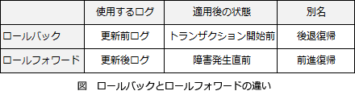

# [R6春期 午前 問27](https://www.ap-siken.com/kakomon/06_haru/q27.html)

#問題 #テクノロジ #データベース #トランザクション処理

解説を表示解説を隠す

<strong>問27</strong>　トランザクションTはチェックポイント後にコミットしたが，その後にシステム障害が発生した。トランザクションTの更新内容をその終了直後の状態にするために用いられる復旧技法はどれか。ここで，トランザクションはWALプロトコルに従い，チェックポイントの他に，トランザクションログを利用する。

<ul class="ap-choices">
<li class="ap-choice-item ap-wrong">

ア　2相ロック

2相<a href="用語/ロック方式" class="internal-link" data-href="用語/ロック方式">ロック方式</a>は，<a href="用語/ロック" class="internal-link" data-href="用語/ロック">ロック</a>の取得段階と解除段階を分けて実行する<a href="用語/ロック方式" class="internal-link" data-href="用語/ロック方式">ロック方式</a>であり，障害回復（復旧）手法ではない。

</li>
<li class="ap-choice-item ap-wrong">

イ　シャドウページ

<a href="用語/シャドウページ法" class="internal-link" data-href="用語/シャドウページ法">シャドウページ法</a>は，ログを使わない<a href="用語/トランザクション" class="internal-link" data-href="用語/トランザクション">トランザクション</a>の障害回復手法である。

</li>
<li class="ap-choice-item ap-wrong">

ウ　ロールバック

<a href="用語/ロールバック" class="internal-link" data-href="用語/ロールバック">ロールバック</a>は，更新前ログを用いて<a href="用語/トランザクション" class="internal-link" data-href="用語/トランザクション">トランザクション</a>開始直前の状態に戻す処理であり，コミット済みの更新内容を反映する目的とは逆になる。

</li>
<li class="ap-choice-item ap-correct">

エ　ロールフォワード

正しい。<a href="用語/ロールフォワード" class="internal-link" data-href="用語/ロールフォワード">ロールフォワード</a>は，更新後ログを用いて処理済み<a href="用語/トランザクション" class="internal-link" data-href="用語/トランザクション">トランザクション</a>を再現し，障害直前まで<a href="用語/データベース" class="internal-link" data-href="用語/データベース">データベース</a>を復旧する。

</li>
</ul>

<h4>解説</h4>

<a href="用語/データベース" class="internal-link" data-href="用語/データベース">データベース</a>は更新処理のたびに，更新前の値と更新後の値を<a href="用語/トランザクションログ" class="internal-link" data-href="用語/トランザクションログ">トランザクションログ</a>として記録している。<a href="用語/トランザクション" class="internal-link" data-href="用語/トランザクション">トランザクション</a>Tの終了直後の状態に戻すには，まず<a href="用語/チェックポイント" class="internal-link" data-href="用語/チェックポイント">チェックポイント</a>時点の状態に戻し，その後，<a href="用語/トランザクションログ" class="internal-link" data-href="用語/トランザクションログ">トランザクションログ</a>を利用して更新内容を反映させていく。

このように，<a href="用語/トランザクションログ" class="internal-link" data-href="用語/トランザクションログ">トランザクションログ</a>（更新後ログ）を用いて障害で失われた更新内容を<a href="用語/データベース" class="internal-link" data-href="用語/データベース">データベース</a>に反映させていく処理を<a href="用語/ロールフォワード" class="internal-link" data-href="用語/ロールフォワード">ロールフォワード</a>（前進復帰）という。

