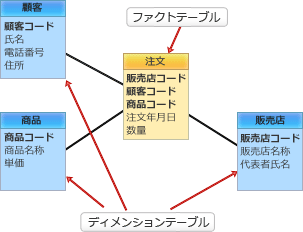

# [R6春期 午前 問28](https://www.ap-siken.com/kakomon/06_haru/q28.html)

#問題 #テクノロジ #データベース #データベース応用

解説を表示解説を隠す

<strong>問28</strong>　データウェアハウスのテーブル構成をスタースキーマとする場合，分析対象のトランザクションデータを格納するテーブルはどれか。

<ul class="ap-choices">
<li class="ap-choice-item ap-wrong">

ア　サマリテーブル

サマリテーブルは，ある分析軸で集計した結果を保存したテーブルであり，分析対象の<a href="用語/トランザクション" class="internal-link" data-href="用語/トランザクション">トランザクション</a>データを格納するテーブルではない。

</li>
<li class="ap-choice-item ap-wrong">

イ　ディメンジョンテーブル

ディメンジョンテーブルは，分析軸となる属性データを格納するテーブルである。

</li>
<li class="ap-choice-item ap-correct">

ウ　ファクトテーブル

正しい。ファクトテーブルは，分析対象となる<a href="用語/トランザクション" class="internal-link" data-href="用語/トランザクション">トランザクション</a>データを格納するテーブルである。

</li>
<li class="ap-choice-item ap-wrong">

エ　ルックアップテーブル

<a href="用語/ルックアップテーブル" class="internal-link" data-href="用語/ルックアップテーブル">ルックアップテーブル</a>は，事前に定義された値のリストを格納するテーブルである。

</li>
</ul>

<h4>解説</h4>

スタースキーマは，多次元<a href="用語/データモデル" class="internal-link" data-href="用語/データモデル">データモデル</a>を表現するように設計されたスキーマで，<a href="用語/データウェアハウス" class="internal-link" data-href="用語/データウェアハウス">データウェアハウス</a>の実装で用いられる。スタースキーマは，1つ以上のファクトテーブルと<a href="用語/外部キー" class="internal-link" data-href="用語/外部キー">外部キー</a>を介して関連付けられている1つ以上のディメンジョンテーブルで構成され，中心となるファクトテーブルに各ディメンジョンテーブルが結ばれた星（スター）型構造をもつため，このように呼ばれる。したがって，分析の対象となる<a href="用語/トランザクション" class="internal-link" data-href="用語/トランザクション">トランザクション</a>データを格納するテーブルは，ファクトテーブルである。

