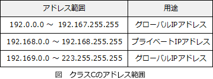

# [令和6年春期 午前 問31](https://www.ap-siken.com/kakomon/06_haru/q31.html)

#問題 #テクノロジ #ネットワーク #通信プロトコル

解説を表示解説を隠す

<strong>問31</strong>　IPアドレス 208.77.188.166 は，どのアドレスに該当するか。

<ul class="ap-choices">
<li class="ap-choice-item ap-correct">

ア　グローバルアドレス

正しい。クラスCのグローバルアドレスです。

</li>
<li class="ap-choice-item ap-wrong">

イ　プライベートアドレス

設問のアドレスはプライベートアドレスの範囲外なので誤りです。

</li>
<li class="ap-choice-item ap-wrong">

ウ　ブロードキャストアドレス

クラスCの<a href="用語/ブロードキャスト" class="internal-link" data-href="用語/ブロードキャスト">ブロードキャスト</a>アドレスであれば、全ビットが"1"になる"255"が<a href="用語/IPアドレス" class="internal-link" data-href="用語/IPアドレス">IPアドレス</a>の下位8ビット部にセットされているはずです。しかし、設問のアドレスには含まれていないため誤りです。

</li>
<li class="ap-choice-item ap-wrong">

エ　マルチキャストアドレス

<a href="用語/マルチキャスト" class="internal-link" data-href="用語/マルチキャスト">マルチキャスト</a>アドレスにはクラスDのアドレスが使用されます。設問のアドレスはクラスCに属するので誤りです。

</li>
</ul>

<h4>解説</h4>

<a href="用語/IPv4" class="internal-link" data-href="用語/IPv4">IPv4</a>アドレスの範囲は 0.0.0.0～255.255.255.255 ですが、その用途によってA～Eの<a href="用語/アドレスクラス" class="internal-link" data-href="用語/アドレスクラス">アドレスクラス</a>に分類されます。<a href="用語/アドレスクラス" class="internal-link" data-href="用語/アドレスクラス">アドレスクラス</a>は、先頭数ビットによって次のように判断できるようになっています。0 ⇒ クラスA10 ⇒ クラスB110 ⇒ クラスC1110 ⇒ クラスDまず、208.77.188.166 の先頭オクテットである"208"を2進数に変換します。20810 ⇒ 110100002先頭がビット"110"で始まるため、208.77.188.166 はクラスCの<a href="用語/IPアドレス" class="internal-link" data-href="用語/IPアドレス">IPアドレス</a>だと判断できます。クラスCにおける<a href="用語/グローバルIPアドレス" class="internal-link" data-href="用語/グローバルIPアドレス">グローバルIPアドレス</a>と<a href="用語/プライベートIPアドレス" class="internal-link" data-href="用語/プライベートIPアドレス">プライベートIPアドレス</a>の範囲は以下のように規定されています。

上表に当てはめると、208.77.188.166 はクラスCのグローバルアドレスと判断できます。

