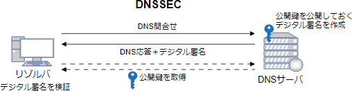

# [R6春期 午前 問37](https://www.ap-siken.com/kakomon/06_haru/q37.html)

#問題 #テクノロジ #セキュリティ #セキュリティ実装技術

解説を表示解説を隠す

<strong>問37</strong>　DNSSECで実現できることはどれか。

<ul class="ap-choices">
<li class="ap-choice-item ap-correct">

ア　DNSキャッシュサーバが得た応答の中のリソースレコードが，権威DNSサーバで管理されているものであり，改ざんされていないことの検証

正しい。応答中のリソースレコードに付与された<a href="用語/デジタル署名" class="internal-link" data-href="用語/デジタル署名">デジタル署名</a>を検証することで，正当性と<a href="用語/完全性" class="internal-link" data-href="用語/完全性">完全性</a>を確認できる。

</li>
<li class="ap-choice-item ap-wrong">

イ　権威DNSサーバとDNSキャッシュサーバとの通信を暗号化することによる，ゾーン情報の漏えいの防止暗号化

<a href="用語/DNSSEC" class="internal-link" data-href="用語/DNSSEC">DNSSEC</a>は応答の正当性検証の仕組みであり，通信の暗号化は行わない（暗号化はDoT/DoHなど）。

</li>
<li class="ap-choice-item ap-wrong">

ウ　長音"ー"と漢数字"一"などの似た文字をドメイン名に用いて，正規サイトのように見せかける攻撃の防止

<a href="用語/DNSSEC" class="internal-link" data-href="用語/DNSSEC">DNSSEC</a>では防げない（類似<a href="用語/ドメイン" class="internal-link" data-href="用語/ドメイン">ドメイン</a>を用いた攻撃への対策ではない）。

</li>
<li class="ap-choice-item ap-wrong">

エ　利用者のURLの入力誤りを悪用して，偽サイトに誘導する攻撃の検知

<a href="用語/DNSSEC" class="internal-link" data-href="用語/DNSSEC">DNSSEC</a>では防げない（<a href="用語/URL" class="internal-link" data-href="用語/URL">URL</a>の入力ミスを悪用するタイポスクワッティング等の検知は<a href="用語/DNSSEC" class="internal-link" data-href="用語/DNSSEC">DNSSEC</a>の対象外）。

</li>
</ul>

<h4>解説</h4>

<a href="用語/DNSSEC" class="internal-link" data-href="用語/DNSSEC">DNSSEC</a>（<a href="用語/DNS" class="internal-link" data-href="用語/DNS">DNS</a> Security Extensions）は，<a href="用語/DNS" class="internal-link" data-href="用語/DNS">DNS</a>応答の正当性を保証するための拡張仕様である。権威<a href="用語/DNS" class="internal-link" data-href="用語/DNS">DNS</a>サーバが応答に<a href="用語/デジタル署名" class="internal-link" data-href="用語/デジタル署名">デジタル署名</a>を付加し，受け取った<a href="用語/DNS" class="internal-link" data-href="用語/DNS">DNS</a>キャッシュサーバが<a href="用語/公開鍵" class="internal-link" data-href="用語/公開鍵">公開鍵</a>で署名を検証することで，応答レコードが<a href="用語/改ざん" class="internal-link" data-href="用語/改ざん">改ざん</a>されていないこと，正当な管理者によって生成されたことを確認できる。したがって，<a href="用語/DNSSEC" class="internal-link" data-href="用語/DNSSEC">DNSSEC</a>で実現できることは「ア」である。

