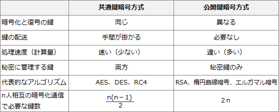

# [R6春期 午前 問38](https://www.ap-siken.com/kakomon/06_haru/q38.html)

#問題 #テクノロジ #セキュリティ #情報セキュリティ

解説を表示解説を隠す

<strong>問38</strong>　公開鍵暗号方式を使った暗号通信をn人が相互に行う場合，全体で何個の異なる鍵が必要になるか。ここで，一組の公開鍵と秘密鍵は2個と数える。

<ul class="ap-choices">
<li class="ap-choice-item ap-wrong">

ア　n＋1

<a href="用語/公開鍵" class="internal-link" data-href="用語/公開鍵">公開鍵</a>と<a href="用語/秘密鍵" class="internal-link" data-href="用語/秘密鍵">秘密鍵</a>を合計2n個数えるので，「n＋1」にはならない。

</li>
<li class="ap-choice-item ap-correct">

イ　2n

正しい。<a href="用語/公開鍵" class="internal-link" data-href="用語/公開鍵">公開鍵</a>暗号では各人が<a href="用語/秘密鍵" class="internal-link" data-href="用語/秘密鍵">秘密鍵</a>1個を保持し，その<a href="用語/秘密鍵" class="internal-link" data-href="用語/秘密鍵">秘密鍵</a>に対応する<a href="用語/公開鍵" class="internal-link" data-href="用語/公開鍵">公開鍵</a>1個を公開するので，合計で2n個の鍵が必要になる。

</li>
<li class="ap-choice-item ap-wrong">

ウ　n(n－1)

<a href="用語/公開鍵" class="internal-link" data-href="用語/公開鍵">公開鍵</a>暗号では相手ごとに共通鍵を用意する必要はないため，組合せ数のような増え方にはならない。

</li>
<li class="ap-choice-item ap-wrong">

エ　log2n

鍵の総数は人数に比例して増えるため，対数にはならない。

</li>
</ul>

<h4>解説</h4>

<a href="用語/公開鍵暗号方式" class="internal-link" data-href="用語/公開鍵暗号方式">公開鍵暗号方式</a>では，受信者が復号鍵（<a href="用語/秘密鍵" class="internal-link" data-href="用語/秘密鍵">秘密鍵</a>）を保持し，対応する暗号化鍵（<a href="用語/公開鍵" class="internal-link" data-href="用語/公開鍵">公開鍵</a>）を公開する。暗号化は誰でもできるが，復号できるのは<a href="用語/秘密鍵" class="internal-link" data-href="用語/秘密鍵">秘密鍵</a>を持つ正規の受信者だけなので通信内容を秘匿できる。

n人が相互に暗号通信する場合，各人が<a href="用語/秘密鍵" class="internal-link" data-href="用語/秘密鍵">秘密鍵</a>を1個ずつ保持するので<a href="用語/秘密鍵" class="internal-link" data-href="用語/秘密鍵">秘密鍵</a>はn個必要である。さらに，各<a href="用語/秘密鍵" class="internal-link" data-href="用語/秘密鍵">秘密鍵</a>に対応する<a href="用語/公開鍵" class="internal-link" data-href="用語/公開鍵">公開鍵</a>がn個必要になるため，鍵の総数は \(n+n=2n\) 個となる。したがって「イ」が正解である。

なお，<a href="用語/共通鍵暗号方式" class="internal-link" data-href="用語/共通鍵暗号方式">共通鍵暗号方式</a>でn人が相互に暗号化通信を行うには，\(n(n-1)/2\) 個（n人から2人を選ぶ組合せと同数）の鍵が必要になる。

