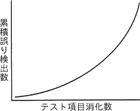
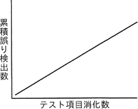
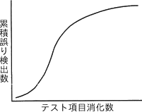
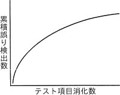
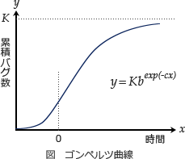

# [R6春期 午前 問47](https://www.ap-siken.com/kakomon/06_haru/q47.html)

#問題 #テクノロジ #システム開発技術 #実装・構築

解説を表示解説を隠す

<strong>問47</strong>　ソフトウェア信頼度成長モデルの一つであって，テスト工程においてバグが収束したと判定する根拠の一つとして使用するゴンペルツ曲線はどれか。

<ul class="ap-choices">
<li class="ap-choice-item ap-wrong">

ア　

テスト終盤になるにつれ、バグの摘出数が右肩上がりに増えています。まだ多くの潜在バグがあると推定できるので、<a href="用語/収束" class="internal-link" data-href="用語/収束">収束</a>しているとは言えません。

</li>
<li class="ap-choice-item ap-wrong">

イ　

テスト終盤になっても、テストごとのバグの摘出数が変わっていません。まだ多くの潜在バグがあると推定できるので、<a href="用語/収束" class="internal-link" data-href="用語/収束">収束</a>しているとは言えません。また、そもそも曲線ではありません。

</li>
<li class="ap-choice-item ap-correct">

ウ　

正しい。S字なのでゴンペルツ曲線です。テストでバグが順調に摘出されていれば、テストの後半になるにつれて摘出バグ数が少なくなり、累積バグ数を示す曲線の傾きは水平に近づいていきます。このような飽和状態になればバグが<a href="用語/収束" class="internal-link" data-href="用語/収束">収束</a>したと判定することができます。

</li>
<li class="ap-choice-item ap-wrong">

エ　

S字ではないのでゴンペルツ曲線ではありません。テスト後半で曲線の傾きがなだらかになっていますが、<a href="用語/回帰分析" class="internal-link" data-href="用語/回帰分析">回帰分析</a>による曲線の<a href="用語/収束" class="internal-link" data-href="用語/収束">収束</a>値を考えるとまだ今後も多くのバグが検出されると推定されます。

</li>
</ul>

<h4>解説</h4>

ソフトウェアテスト工程では、<a href="用語/テスト計画" class="internal-link" data-href="用語/テスト計画">テスト計画</a>に基づき、バグ<a href="用語/管理図" class="internal-link" data-href="用語/管理図">管理図</a>などを用いてテストの消化数とバグ摘出数の関係を分析します。記録されたデータをゴンペルツ曲線や過去の実績と比較することで、プログラムの品質を定量的に予測します。

ゴンペルツ曲線とは、バグ<a href="用語/管理図" class="internal-link" data-href="用語/管理図">管理図</a>に現れる以下のようなS字の曲線で、バグの摘出数はテスト初期では少なく、中盤では急激に多くなり、後半に近づくと少なくなるという確率測を表現したものです。信頼度成長曲線とも呼ばれます。

テスト初期：プログラムのメイン機能に関する大きなバグが見つかり、その修正に時間を要するためにバグの摘出数は少なくなる テスト中盤：メイン機能のバグが修正され、細かな部分のバグが多く摘出される テスト後半：これまでのテストで大部分のバグが摘出され、摘出できる数が少なくなる

この仕組みを踏まえて各選択肢の正誤を判断します。

