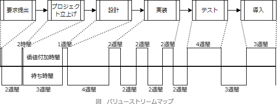

# [R6春期 午前 問48](https://www.ap-siken.com/kakomon/06_haru/q48.html)

#問題 #テクノロジ #ソフトウェア開発管理技術 #開発プロセス・手法

解説を表示解説を隠す

<strong>問48</strong>　リーンソフトウェア開発において，ソフトウェア開発のプロセスとプロセスの所要時間とを可視化し，ボトルネックや無駄がないかどうかを確認するのに用いるものはどれか。

<ul class="ap-choices">
<li class="ap-choice-item ap-wrong">

ア　ストーリーカード

ソフトウェアで実現したいことを<a href="用語/顧客価値" class="internal-link" data-href="用語/顧客価値">顧客価値</a>を明確にして簡潔に書き出したカードであり、開発チームとプロダクトオーナー・顧客との会話の促進や受入テストの確認に用います。プロセスと所要時間の可視化には用いません。

</li>
<li class="ap-choice-item ap-wrong">

イ　スプリントバックログ

<a href="用語/プロダクトバックログ" class="internal-link" data-href="用語/プロダクトバックログ">プロダクトバックログ</a>のうち今回の<a href="用語/スプリント" class="internal-link" data-href="用語/スプリント">スプリント</a>で追加することとされた機能のリストであり、<a href="用語/イテレーション" class="internal-link" data-href="用語/イテレーション">イテレーション</a>で開発すべき項目・作業を管理するために用います。プロセスと所要時間の可視化には用いません。

</li>
<li class="ap-choice-item ap-wrong">

ウ　バーンダウンチャート

縦軸に「残作業量」、横軸に「時間」を取った<a href="用語/折れ線グラフ" class="internal-link" data-href="用語/折れ線グラフ">折れ線グラフ</a>であり、残作業量や予定との差異を視覚的に把握するために用います。プロセスと所要時間の可視化には用いません。

</li>
<li class="ap-choice-item ap-correct">

エ　バリューストリームマップ

正しい。顧客要求の受入れから機能完成までのプロセスを横に並べ、時間軸に<a href="用語/付加価値" class="internal-link" data-href="用語/付加価値">付加価値</a>に費やした時間とそれ以外の時間を分けて描くことで、ボトルネックやムダを発見できます。

</li>
</ul>

<h4>解説</h4>

<a href="用語/リーンソフトウェア開発" class="internal-link" data-href="用語/リーンソフトウェア開発">リーンソフトウェア開発</a>は、トヨタ<a href="用語/生産方式" class="internal-link" data-href="用語/生産方式">生産方式</a>を一般化したリーン<a href="用語/生産方式" class="internal-link" data-href="用語/生産方式">生産方式</a>をそのままソフトウェア開発に当てはめて、ムダのない開発プロセスを目指す<a href="用語/アジャイル" class="internal-link" data-href="用語/アジャイル">アジャイル</a>開発の方法論です。トヨタ<a href="用語/生産方式" class="internal-link" data-href="用語/生産方式">生産方式</a>と同じ「7つのムダ」を排除することを目的とした22の思考ツールが提案されています。

正しい。バリューストリームマップは、もともとはトヨタ<a href="用語/生産方式" class="internal-link" data-href="用語/生産方式">生産方式</a>で使われていたもので、<a href="用語/付加価値" class="internal-link" data-href="用語/付加価値">付加価値</a>を生みだす流れをプロセスとともに図示する<a href="用語/フローチャート" class="internal-link" data-href="用語/フローチャート">フローチャート</a>です。<a href="用語/リーンソフトウェア開発" class="internal-link" data-href="用語/リーンソフトウェア開発">リーンソフトウェア開発</a>版のバリューストリームマップは、顧客要求の受入れからその要求を満たす機能が完成するまでのプロセスを横に並べ、その下の時間軸に価値の付加に費やされた時間とそれ以外の時間とを分けて描きます。これを分析することで、<a href="用語/付加価値" class="internal-link" data-href="用語/付加価値">付加価値</a>を生む時間以外のムダな時間や工程のボトルネックを発見し、開発プロセスの改善につなげることができます。 

