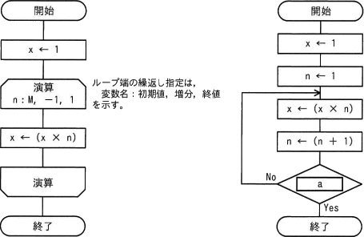

# [令和6年春期 午前 問5](https://www.ap-siken.com/kakomon/06_haru/q5.html)

#問題 #テクノロジ #アルゴリズムとプログラミング #アルゴリズム

解説を表示解説を隠す

<strong>問5</strong>　正の整数Mに対して，次の二つの流れ図に示すアルゴリズムを実行したとき，結果xの値が等しくなるようにしたい。aに入れる条件として，適切なものはどれか。 

<ul class="ap-choices">
<li class="ap-choice-item ap-wrong">

ア　n ＜ M

n=2、M=2なので 2＜2 は No でループ先頭へ戻る。以後ループ内で n は1ずつ加算されるため n＜M を満たすことはなく，無限ループとなる。

</li>
<li class="ap-choice-item ap-wrong">

イ　n ＞ M－1

n=2、M=2なので 2＞2－1 は Yes でループから抜ける。結果 x は1となり，左の<a href="用語/流れ図" class="internal-link" data-href="用語/流れ図">流れ図</a>の x=2 と異なる。

</li>
<li class="ap-choice-item ap-correct">

ウ　n ＞ M

正しい。M=2 のとき左の<a href="用語/流れ図" class="internal-link" data-href="用語/流れ図">流れ図</a>と同じ x=2 になる条件である。

</li>
<li class="ap-choice-item ap-wrong">

エ　n ＞ M＋1

n=2、M=2ではループを続け x=2 になるが，その後 n=4 で 4＞2＋1 となり抜けたとき x=6 となり，左の<a href="用語/流れ図" class="internal-link" data-href="用語/流れ図">流れ図</a>と異なる。

</li>
</ul>

<h4>解説</h4>

二つの<a href="用語/アルゴリズム" class="internal-link" data-href="用語/アルゴリズム">アルゴリズム</a>で共通の M は正の整数という条件が問題文に示されているので，M に適当な数値を当てはめることで解答を導きます。正の整数であれば何でもよいが，本解説では M=2 とします。まず左の<a href="用語/アルゴリズム" class="internal-link" data-href="用語/アルゴリズム">アルゴリズム</a>を解き，その結果の x の値が右の式でも出力される条件を考えます。

<strong>左の<a href="用語/流れ図" class="internal-link" data-href="用語/流れ図">流れ図</a></strong> 《開始》1 → x　//x=1 《ループ条件》n:2、増分 -1、n=1で終了（n=2）1×2 → x　//x=2 （n=1）ループから抜ける 《終了》//x=2

<strong>右の<a href="用語/流れ図" class="internal-link" data-href="用語/流れ図">流れ図</a>（aの直前まで）</strong> 《開始》1 → x　//x=1 1 → n　//n=1 1×1 → x　//x=1 1＋1 → n　//n=2

この状態の右の<a href="用語/流れ図" class="internal-link" data-href="用語/流れ図">流れ図</a>において，a に各選択肢の条件式を入れたときに結果 x が 2 となるかどうかを見ます。

<strong>ウ n＞M の場合</strong> 1×2 → x　//x=2 2＋1 → n　//n=3 n=3、M=2なので 3＞2 ⇒ Yes でループから抜ける　//x=2 結果 x は 2 で左の<a href="用語/流れ図" class="internal-link" data-href="用語/流れ図">流れ図</a>と同じ値になる。

<strong>エ n＞M＋1 の場合</strong> 1×2 → x　//x=2 2＋1 → n　//n=3 n=3、M=2なので 3＞2＋1 ⇒ No でループ先頭へ戻る　//x=2 2×3 → x　//x=6 3＋1 → n　//n=4 n=4、M=2なので 4＞2＋1 ⇒ Yes でループから抜ける　//x=6 結果 x は 6 で左の<a href="用語/流れ図" class="internal-link" data-href="用語/流れ図">流れ図</a>とは異なる。

以上より，二つの<a href="用語/アルゴリズム" class="internal-link" data-href="用語/アルゴリズム">アルゴリズム</a>の結果を同じにする条件 a として「ウ」が適切です。<a href="用語/流れ図" class="internal-link" data-href="用語/流れ図">流れ図</a>の詳細は問題図を参照してください。

