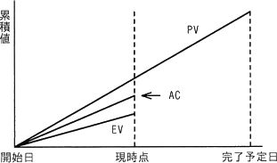

# [R6春期 午前 問51](https://www.ap-siken.com/kakomon/06_haru/q51.html)

#問題 #マネジメント #プロジェクトマネジメント #プロジェクトの時間

解説を表示解説を隠す

<strong>問51</strong>　EVMで管理しているプロジェクトがある。図は，プロジェクトの開始から完了予定までの期間の半分が経過した時点での状況である。コスト効率，スケジュール効率がこのままで推移すると仮定した場合の見通しのうち，適切なものはどれか。 

<ul class="ap-choices">
<li class="ap-choice-item ap-correct">

ア　計画に比べてコストは多くなり，プロジェクトの完了は遅くなる。

正しい。図では EV＜AC（コスト超過）かつ EV＜PV（スケジュール遅延）であり、このまま推移すれば計画よりコストがかかり完了も遅れる。

</li>
<li class="ap-choice-item ap-wrong">

イ　計画に比べてコストは多くなり，プロジェクトの完了は早くなる。

コスト超過（EV＜AC）の見通しは合うが、EV＜PV はスケジュール遅延であり、完了が早くなる見通しにはならない。

</li>
<li class="ap-choice-item ap-wrong">

ウ　計画に比べてコストは少なくなり，プロジェクトの完了は遅くなる。

EV＜AC は予算（EV）より実コスト（AC）が大きい状態であり、コストが少なくなる見通しにはならない。

</li>
<li class="ap-choice-item ap-wrong">

エ　計画に比べてコストは少なくなり，プロジェクトの完了は早くなる。

図は EV＜AC かつ EV＜PV であり、コスト超過とスケジュール遅延の見通しとなる。

</li>
</ul>

<h4>解説</h4>

<a href="用語/EVM" class="internal-link" data-href="用語/EVM">EVM</a>（Earned Value Management）は、プロジェクトにおける作業を金銭の価値に置き換えて定量的に実績管理をする<a href="用語/進捗管理" class="internal-link" data-href="用語/進捗管理">進捗管理</a>手法です。PV、EV、AC の3つの指標を用いて管理するのが特徴です。

PV（Planned Value）…プロジェクト開始当初、現時点までに計画されていた作業に対する予算 EV（Earned Value）…現時点までに完了した作業に割り当てられていた予算 AC（Actual Cost）…現時点までに完了した作業に対して実際に投入した総コスト

EV と AC を比べることでコスト差異（CV）を、EV と PV を比べることでスケジュール差異（SV）を分析します。コスト・スケジュールのどちらも、EV のほうが大きければ良好な状態と言えます。

EV＞AC（予算内）⇒予算（EV）よりも小さいコスト（AC）で済んでいる EV＜AC（予算オーバー）⇒予算（EV）よりも大きなコスト（AC）がかかっている EV＞PV（スケジュール先行）⇒予定進捗（PV）よりも、実際の進捗（EV）が先行している EV＜PV（スケジュール遅延）⇒予定進捗（PV）よりも、実際の進捗（EV）が遅れている

【コストについて】設問の図を見ると「EV＜AC」となっています。完了した作業に割り当てられていた予算（EV）よりも、実コスト（AC）が大きいということは、コスト超過の状態となっています。よって、このまま進めばコスト超過となります。

【スケジュールについて】設問の図を見ると「EV＜PV」となっています。完了した作業に割り当てられていた予算（EV）よりも、当初のスケジュールで消化予定だった予算（PV）が大きいということは、当初のスケジュールよりも遅れています。よって、このまま進めばスケジュール遅延となります。

したがって図の適切な解釈は「ア」です。

