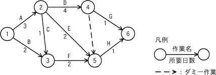

# [R6春期 午前 問52](https://www.ap-siken.com/kakomon/06_haru/q52.html)

#問題 #マネジメント #プロジェクトマネジメント #プロジェクトの時間

解説を表示解説を隠す

<strong>問52</strong>　図のアローダイアグラムで表されるプロジェクトがある。結合点5の最早結合点時刻はプロジェクト開始から第何日か。ここで，プロジェクトの開始日は0日目とする。 

<ul class="ap-choices">
<li class="ap-choice-item ap-wrong">

ア　4

B→Fの経路（2＋2＝4日）の完了日数と混同している。

</li>
<li class="ap-choice-item ap-wrong">

イ　5

A→Eの経路（3＋2＝5日）の完了日数と混同している。

</li>
<li class="ap-choice-item ap-wrong">

ウ　6

A→C→Fの経路（3＋1＋2＝6日）の完了日数と混同している。

</li>
<li class="ap-choice-item ap-correct">

エ　7

正しい。結合点5に至る<a href="用語/クリティカルパス" class="internal-link" data-href="用語/クリティカルパス">クリティカルパス</a>A→D（3＋4＝7日）に基づき、最早結合点時刻は第7日である。

</li>
</ul>

<h4>解説</h4>

<a href="用語/アローダイアグラム" class="internal-link" data-href="用語/アローダイアグラム">アローダイアグラム</a>の最早結合点時刻は、その結合点からの作業が開始できるようになる最も早い日と表します。ある結合点から作業を開始するには、その先行作業がすべて終了していなければならないため、設問では結合点5に至る先行作業をすべて完了するために必要となる日数を考えることになります。

結合点5へと至る工程の流れは、A→D、A→E、A→C→F、B→Fの4つです。それぞれの完了に要する日数は以下のとおりです。

<ul>
<li>A→D　3＋4＝7日</li>
<li>A→E　3＋2＝5日</li>
<li>A→C→F　3＋1＋2＝6日</li>
<li>B→F　2＋2＝4日</li>
</ul>

最も長いのは「A→D」の7日なので、結合点5に至る先行作業の終了には7日間（0日目から6日目まで）を要します。作業Hを開始できるのはその翌日である7日目からなので、結合点5の最早結合点時刻はプロジェクト開始日から数えて第7日となります。したがって「エ」が正解です。

