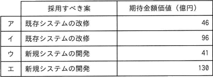
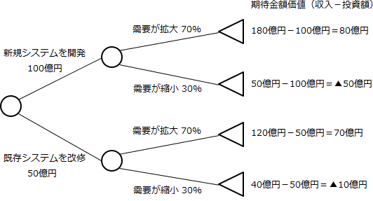

# [R6春期 午前 問54](https://www.ap-siken.com/kakomon/06_haru/q54.html)

#問題 #マネジメント #プロジェクトマネジメント #プロジェクトの調達

解説を表示解説を隠す

<strong>問54</strong>　工場の生産能力を増強する方法として，新規システムを開発する案と既存システムを改修する案とを検討している。次の条件で，期待金額価値の高い案を採用するとき，採用すべき案と期待金額価値との組合せのうち，適切なものはどれか。ここで，期待金額価値は，収入と投資額との差で求める。  〔条件〕 新規システムを開発する場合の投資額は100億円であって，既存システムを改修する場合の投資額は50億円である。 需要が拡大する確率は70%であって，需要が縮小する確率は30%である。 新規システムを開発した場合、需要が拡大したときは180億円の収入が見込まれ，需要が縮小したときは50億円の収入が見込まれる。 既存システムを改修した場合，需要が拡大したときは120億円の収入が見込まれ，需要が縮小したときは40億円の収入が見込まれる。 他の条件は考慮しない。 

<ul class="ap-choices">
<li class="ap-choice-item ap-correct">

ア

正しい。期待金額価値が高いのは既存システムの改修（46億円）。

</li>
<li class="ap-choice-item ap-wrong">

イ

採用すべき案と期待金額価値の組合せが誤っています。組合せは選択肢表を参照してください。

</li>
<li class="ap-choice-item ap-wrong">

ウ

採用すべき案と期待金額価値の組合せが誤っています。組合せは選択肢表を参照してください。

</li>
<li class="ap-choice-item ap-wrong">

エ

採用すべき案と期待金額価値の組合せが誤っています。組合せは選択肢表を参照してください。

</li>
</ul>

<h4>解説</h4>

新規システムを開発する場合と、既存システムを改修する場合のそれぞれに、需要が拡大・需要が縮小の2通りのケースが存在します。<a href="用語/デシジョンツリー" class="internal-link" data-href="用語/デシジョンツリー">デシジョンツリー</a>で表すと以下のとおりです。

新規システムを開発する案の期待金額価値 80×0.7＋▲50×0.3＝56－15＝41億円

既存システムを改修する案の期待金額価値 70×0.7＋▲10×0.3＝49－3＝46億円

採用すべきは2つを比べて期待金額価値が高い「既存システムの改修」、その期待金額価値は「46億円」です。したがって「ア」の組合せが適切です。

