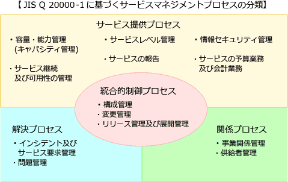

# [R6春期 午前 問56](https://www.ap-siken.com/kakomon/06_haru/q56.html)

#問題 #マネジメント #サービスマネジメント #サービスマネジメントプロセス

解説を表示解説を隠す

<strong>問56</strong>　サービスマネジメントにおけるサービスレベル管理プロセスの活動はどれか。

<ul class="ap-choices">
<li class="ap-choice-item ap-wrong">

ア　現在の資源の調整と最適化とを行い，将来の資源要件に関する予測を記載した計画を作成する。

これは<a href="用語/キャパシティ管理" class="internal-link" data-href="用語/キャパシティ管理">キャパシティ管理</a>の活動です。

</li>
<li class="ap-choice-item ap-wrong">

イ　サービスの提供に必要な予算に応じて，適切な資金を確保する。

これは<a href="用語/サービスの予算業務及び会計業務" class="internal-link" data-href="用語/サービスの予算業務及び会計業務">サービスの予算業務及び会計業務</a>の活動です。

</li>
<li class="ap-choice-item ap-wrong">

ウ　災害や障害などで事業が中断しても，要求されたサービス機能を合意された期間内に確実に復旧できるように，事業影響度の評価や復旧優先順位を明確にする。

これはサービス継続及び可用性管理の活動です。

</li>
<li class="ap-choice-item ap-correct">

エ　提供するサービス及びサービスレベル目標を決定し，サービス提供者が顧客との間で合意文書を交わす。

正しい。<a href="用語/サービスレベル管理" class="internal-link" data-href="用語/サービスレベル管理">サービスレベル管理</a>の活動です。

</li>
</ul>

<h4>解説</h4>

<a href="用語/サービスレベル管理" class="internal-link" data-href="用語/サービスレベル管理">サービスレベル管理</a>(Service Level Management)は、<a href="用語/SLA" class="internal-link" data-href="用語/SLA">SLA</a>に基づいて顧客要件を満たすサービスの提供を実現するとともに、<a href="用語/サービス品質" class="internal-link" data-href="用語/サービス品質">サービス品質</a>の継続的な改善を図るための管理活動です。<a href="用語/サービスレベル目標" class="internal-link" data-href="用語/サービスレベル目標">サービスレベル目標</a>や例外を定めて、顧客とサービス提供者の間で<a href="用語/SLA" class="internal-link" data-href="用語/SLA">SLA</a>(Service Level Agreement)を合意するのもその活動のひとつです。サービスレベルの維持・管理を行うために「<a href="用語/モニタリング" class="internal-link" data-href="用語/モニタリング">モニタリング</a>」「レポーティング」「レビュー」「改善」という<a href="用語/PDCA" class="internal-link" data-href="用語/PDCA">PDCA</a>サイクルを繰り返します。

したがって、<a href="用語/SLA" class="internal-link" data-href="用語/SLA">SLA</a>について記述している「エ」が適切です。

