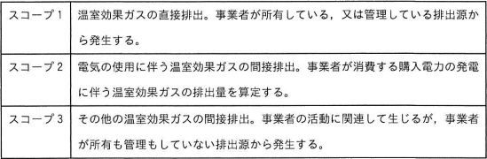

# [令和6年春期 午前 問57](https://www.ap-siken.com/kakomon/06_haru/q57.html)

#問題 #マネジメント #サービスマネジメント #ファシリティマネジメント

解説を表示解説を隠す

<strong>問57</strong>　温室効果ガスの排出量の算定基準であるGHGプロトコルでは，事業者の事業活動によって直接的又は間接的に排出される温室効果ガスについて，スコープを三つに分けている。事業者X社がデータセンター事業者であるときの，スコープ1の例として，適切なものはどれか。 〔GHGプロトコルにおけるスコープの説明〕 

<ul class="ap-choices">
<li class="ap-choice-item ap-wrong">

ア　X社が自社で管理するIT機器を使用するために購入した電力の，発電に伴う温室効果ガス

データセンターの施設運用のために他の事業者から電力を購入した場合、その発電に伴う温室効果ガスの排出はスコープ2に含まれます。

</li>
<li class="ap-choice-item ap-wrong">

イ　X社が自社で管理するIT機器を廃棄処分するときに，産業廃棄物処理事業者が排出する温室効果ガス

廃棄物の処理に当たり他の事業者で生じた排出は、スコープ3に含まれます。

</li>
<li class="ap-choice-item ap-correct">

ウ　X社が自社で管理する発電装置を稼働させることによって発生する温室効果ガス

正しい。自社で発電を行っている場合、その発電に伴う温室効果ガスの排出はスコープ1に含まれます。

</li>
<li class="ap-choice-item ap-wrong">

エ　X社が提供するハウジングサービスを利用する企業が自社で管理するIT機器を使用するために購入した電力の，発電に伴う温室効果ガス

X社の排出には含めません。データセンターの機器はエネルギー管理権限を持つものが負うとされているため、利用企業のスコープ2に含まれる排出です。

</li>
</ul>

<h4>解説</h4>

<a href="用語/GHGプロトコル" class="internal-link" data-href="用語/GHGプロトコル">GHGプロトコル</a>は、事業者が行う温室効果ガス(GHG：Greenhouse Gas)の排出量を算定・報告する際の基準を定めた国際的な枠組みです。1997年に採択された京都議定書に基づいて開発され、世界中の多くの企業や政府が採用しています。

<a href="用語/GHGプロトコル" class="internal-link" data-href="用語/GHGプロトコル">GHGプロトコル</a>では、排出される温室効果ガスについて、報告事業者が所有・経営支配している排出源より生じた「直接的排出」と、報告事業者の活動の結果であるが他の事業者が所有・経営支配している排出源からの排出である「間接的排出」とに分類し、3つの報告範囲を定めています。スコープ1が直接的排出、スコープ2・3が間接的排出です。

<strong>スコープ1</strong>　事業者が所有・経営支配している排出源より生じた直接的な排出 例）電力・熱・蒸気の生産、物理的・科学的な生産プロセス、事業者が所有する乗り物での輸送、一時的排出など

<strong>スコープ2</strong>　電力・熱・蒸気の導入または購入による間接的な排出

<strong>スコープ3</strong>　事業者の活動に伴うスコープ2以外の間接的な排出 例）他の事業者の乗り物での輸送、従業員の通勤・出張、製品の使用、<a href="用語/アウトソーシング" class="internal-link" data-href="用語/アウトソーシング">アウトソーシング</a>した活動など

