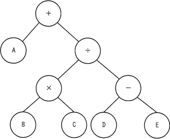
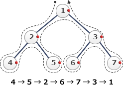

# [令和6年春期 午前 問6](https://www.ap-siken.com/kakomon/06_haru/q6.html)

#問題 #テクノロジ #アルゴリズムとプログラミング #アルゴリズム

解説を表示解説を隠す

<strong>問6</strong>　各ノードがもつデータを出力する再帰処理 f(ノードn) を定義した。この処理を，図の2分木の根(最上位のノード)から始めたときの出力はどれか。  〔f(ノードn)の定義〕 1. ノードnの右に子ノードrがあれば，f(ノードr)を実行 2. ノードnの左に子ノードlがあれば，f(ノードl)を実行 3. 再帰処理 f(ノードr)，f(ノードl) を未実行の子ノード，又は子ノードがなければ，ノード自身がもつデータを出力 4. 終了 

<ul class="ap-choices">
<li class="ap-choice-item ap-wrong">

ア　＋÷－ED×CBA

右→左→中の<a href="用語/後行順" class="internal-link" data-href="用語/後行順">後行順</a>による出力ではない。別の走査順の結果。

</li>
<li class="ap-choice-item ap-wrong">

イ　ABC×DE－÷＋

f(ノードn)の定義どおりの走査では得られない出力。

</li>
<li class="ap-choice-item ap-wrong">

ウ　E－D＋C×B＋A

f(ノードn)の定義どおりの走査では得られない出力。

</li>
<li class="ap-choice-item ap-correct">

エ　ED－CB×÷A＋

正しい。定義どおり右→左→中の順で子を走査し，子がなくなった時点で自身のデータを出力する<a href="用語/後行順" class="internal-link" data-href="用語/後行順">後行順</a>の結果。

</li>
</ul>

<h4>解説</h4>

1.⇒2.⇒3.の流れより、f(ノードn)は、あるノードを右⇒左⇒中の順で走査していくものとわかります。子ノードがなくなった時点で自身のデータを出力するこのような探索方法は、<a href="用語/後行順" class="internal-link" data-href="用語/後行順">後行順</a>の<a href="用語/深さ優先探索" class="internal-link" data-href="用語/深さ優先探索">深さ優先探索</a>と呼ばれます。

<ul>
<li>帰りがけ順(<a href="用語/後行順" class="internal-link" data-href="用語/後行順">後行順</a>) … 移動する子がなくなったタイミングで調べる。※下図は左⇒右⇒中なので設問とは逆向きです。</li>
</ul>

f(ノードn) を根ノードから始めた場合、再帰処理は次のように進んでいきます。

f(＋)　右の子があるので f(÷) を実行 　f(÷)　右の子があるので f(－) を実行 　　f(－)　右の子があるので f(E) を実行 　　　f(E)　子がないのでEを出力 　　f(－)に戻る　左の子があるので f(D) を実行 　　　f(D)　子がないのでDを出力 　　　EDと続いたので、この時点で解答が確定します 　　f(－)に戻る　左右の子は実行済みなので自身の値－を出力 　f(÷)に戻る　左の子があるので f(×) を実行 　　f(×)　右の子があるので f(C) を実行 　　　f(C)　子がないのでCを出力 　　f(×)に戻る　左の子があるので f(B) を実行 　　　f(B)　子がないのでBを出力 　　f(×)に戻る　左右の子は実行済みなので自身の値×を出力 　f(÷)に戻る　左右の子は実行済みなので自身の値÷を出力 f(＋)に戻る　左の子があるので f(A) を実行 　f(A)　子がないのでAを出力 f(＋)に戻る　左右の子は実行済みなので自身の値＋を出力

したがって出力は「ED－CB×÷A＋」となります。

