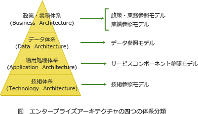

# [R6春期 午前 問61](https://www.ap-siken.com/kakomon/06_haru/q61.html)

#問題 #ストラテジ #システム戦略 #情報システム戦略

解説を表示解説を隠す

<strong>問61</strong>　エンタープライズアーキテクチャの参照モデルのうち，BRM(Business Reference Model)として提供されるものはどれか。

<ul class="ap-choices">
<li class="ap-choice-item ap-wrong">

ア　アプリケーションサービスを機能的な観点から分類体系化したサービスコンポーネント

サービスコンポーネント<a href="用語/参照モデル" class="internal-link" data-href="用語/参照モデル">参照モデル</a>(SRM)が提供するものです。

</li>
<li class="ap-choice-item ap-wrong">

イ　サービスコンポーネントを実際に活用するためのプラットフォームやテクノロジの標準仕様

技術<a href="用語/参照モデル" class="internal-link" data-href="用語/参照モデル">参照モデル</a>(TRM)が提供するものです。

</li>
<li class="ap-choice-item ap-correct">

ウ　参照モデルの中で最も業務に近い階層として提供される，業務分類に従った業務体系及びシステム体系と各種業務モデル

正しい。政策・業務<a href="用語/参照モデル" class="internal-link" data-href="用語/参照モデル">参照モデル</a>(BRM)が提供するものです。

</li>
<li class="ap-choice-item ap-wrong">

エ　組織間で共有される可能性の高い情報について，名称，定義及び各種属性を総体的に記述したモデル

データ<a href="用語/参照モデル" class="internal-link" data-href="用語/参照モデル">参照モデル</a>(DRM)が提供するものです。

</li>
</ul>

<h4>解説</h4>

エンタープライズアーキテクチャ(EA)は、社会環境や情報技術の変化に素早く対応できるよう「全体最適」の観点から業務やシステムを改善する<a href="用語/フレームワーク" class="internal-link" data-href="用語/フレームワーク">フレームワーク</a>です。EAの<a href="用語/参照モデル" class="internal-link" data-href="用語/参照モデル">参照モデル</a>は、EAのひな型として利用するように整備されたもので、EA策定の際に活用できる業務タイプやデータタイプ、アプリケーション構成のオプション、技術などを広範に収集・整理した資料です。

EAの<a href="用語/参照モデル" class="internal-link" data-href="用語/参照モデル">参照モデル</a>は5つあり、EAを構成する4つの体系（ビジネス・データ・アプリケーション・テクノロジ）のそれぞれに対応しています。

政策・業務<a href="用語/参照モデル" class="internal-link" data-href="用語/参照モデル">参照モデル</a>（BRM）…組織内で行われている業務を体系的に整理するモデル

業績測定<a href="用語/参照モデル" class="internal-link" data-href="用語/参照モデル">参照モデル</a>（PRM）…情報化投資の効果を客観的に評価するために作られたものであり、評価のための<a href="用語/KPI" class="internal-link" data-href="用語/KPI">KPI</a>を整理したモデル

データ<a href="用語/参照モデル" class="internal-link" data-href="用語/参照モデル">参照モデル</a>（DRM）…組織を超えて流通もしくは共有される可能性の高い情報・データの名称、定義および属性（桁数、数値、文字列など）について統一的に記述したもの

サービスコンポーネント<a href="用語/参照モデル" class="internal-link" data-href="用語/参照モデル">参照モデル</a>（SRM）…アプリケーションを機能（サービス）の観点からソフトウェア部品（コンポーネント）として<a href="用語/標準化" class="internal-link" data-href="用語/標準化">標準化</a>・分類体系化し、<a href="用語/再利用" class="internal-link" data-href="用語/再利用">再利用</a>可能とするためのモデル

技術<a href="用語/参照モデル" class="internal-link" data-href="用語/参照モデル">参照モデル</a>（TRM）…主要となる技術をアプリケーションソフトウェア、アプリケーションプラットフォーム、外部環境、共通基盤の4つの観点から<a href="用語/標準化" class="internal-link" data-href="用語/標準化">標準化</a>・分類体系化したモデル

