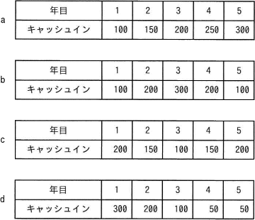

# [R6春期 午前 問64](https://www.ap-siken.com/kakomon/06_haru/q64.html)

#問題 #ストラテジ #システム企画 #システム化計画

解説を表示解説を隠す

<strong>問64</strong>　IT投資案件において，投資効果をPBP(Pay Back Period)で評価する。投資額が500のとき，期待できるキャッシュインの四つのシナリオa～dのうち，効果が最も高いものはどれか。 

<ul class="ap-choices">
<li class="ap-choice-item ap-wrong">

ア　a

1年目100＋2年目150＋3年目200の3年間で450、残り50を4年目の250で回収するまで0.2年かかるため、回収期間は約3.2年です。d案より長いです。

</li>
<li class="ap-choice-item ap-wrong">

イ　b

1年目100＋2年目200で300、残り200を3年目の300で回収するまで約0.67年かかるため、回収期間は約2.6年です。d案より長いです。

</li>
<li class="ap-choice-item ap-wrong">

ウ　c

1年目200＋2年目150＋3年目100の3年間で450、残り50を4年目の150で回収するまで約0.33年かかるため、回収期間は約3.3年です。d案より長いです。

</li>
<li class="ap-choice-item ap-correct">

エ　d

正しい。1年目300＋2年目200の2年間で投資額500を回収できるため、回収期間は2年で最も短く、<a href="用語/PBP" class="internal-link" data-href="用語/PBP">PBP</a>の観点では最も効果が高いシナリオです。

</li>
</ul>

<h4>解説</h4>

<a href="用語/PBP" class="internal-link" data-href="用語/PBP">PBP</a>(Pay Back Period：回収期間法)は、投資から生み出されたキャッシュフローで投資額を回収できるまでの期間を求め、その期間の長短で投資の有利・不利を比較する方法です。回収できる期間が短いほど良い投資と判断されます。

各案が投資額の500を回収するまでに要する年数は次のとおりです。

a案：1年目100＋2年目150＋3年目200の3年間で450、残りの50を回収するまでの期間は「50÷250＝0.2年」なので3.2年です。

b案：1年目100＋2年目200の2年間で300、残り200を回収するまでの期間は「200÷300＝0.666…年」なので約2.6年です。

c案：1年目200、2年目150、3年目100の3年間で450、残り50を回収するまでの期間は「50÷150＝0.333…年」なので約3.3年です。

d案：1年目300、2年目200の2年間で500を回収できます。

回収期間が短いほど投資効率が高いことになるので、投資額を一番早く回収できる「d案」が最も効果が高いと判断されます。

