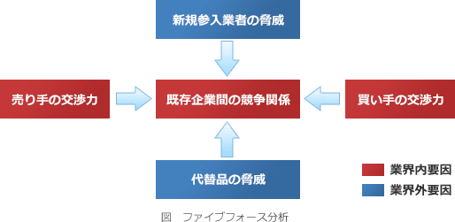

# [令和6年春期 午前 問68](https://www.ap-siken.com/kakomon/06_haru/q68.html)

#問題 #ストラテジ #経営戦略マネジメント #経営戦略手法

解説を表示解説を隠す

<strong>問68</strong>　企業が属する業界の競争状態と収益構造を，"新規参入の脅威"，"供給者の支配力"，"買い手の交渉力"，"代替製品・サービスの脅威"，"既存競合者同士の敵対関係"の要素に分類して，分析するフレームワークはどれか。

<ul class="ap-choices">
<li class="ap-choice-item ap-wrong">

ア　PEST分析

これは<a href="用語/PEST分析" class="internal-link" data-href="用語/PEST分析">PEST分析</a>の説明です。政治(Politics)、経済(Economy)、社会(Society)、技術(Technology)の4つの側面からマクロ環境を分析するフレームワークです。

</li>
<li class="ap-choice-item ap-wrong">

イ　VRIO分析

これは<a href="用語/VRIO分析" class="internal-link" data-href="用語/VRIO分析">VRIO分析</a>の説明です。企業の経営資源をValue（経済的価値)、Rarity（希少性)、Imitability（模倣困難性)、Organization（組織）の4つの視点で評価し、強みと弱みの質や<a href="用語/競争優位" class="internal-link" data-href="用語/競争優位">競争優位</a>性を評価・分析するフレームワークです。

</li>
<li class="ap-choice-item ap-wrong">

ウ　バリューチェーン分析

これはバリューチェーン分析の説明です。製品やサービスの価値が企業のどの活動により生み出されているかを分析し、業務プロセスの強み・弱みを明らかにすることを目的としたフレームワークです。

</li>
<li class="ap-choice-item ap-correct">

エ　ファイブフォース分析

正しい。<a href="用語/ファイブフォース分析" class="internal-link" data-href="用語/ファイブフォース分析">ファイブフォース分析</a>は、業界の収益性を決める5つの競争要因から、業界構造を分析するフレームワークです。

</li>
</ul>

<h4>解説</h4>

<a href="用語/ファイブフォース分析" class="internal-link" data-href="用語/ファイブフォース分析">ファイブフォース分析</a>は、業界の収益性を決める5つの競争要因から、その業界の構造を分析するフレームワークです。業界の魅力度を評価したり、業界の収益性を支える要因や収益性を制限する要因などを理解したりするために使用されます。

競争要因とされるのは「売り手の交渉力」「買い手の交渉力」「競争企業間の敵対関係」という3つの内的要因と、「新規参入者の脅威」「代替品の脅威」という2つの外的要因です。いずれも業界全体の価格とコストに影響を及ぼすもので、各要因の力が大きくなれば価格下落やコスト増加により収益性は低下、小さくなれば逆の作用により収益性は上昇します。複雑に絡み合った競争を5つの要因に分解して評価することで、業界がどのように機能しているかを把握するのに役立ちます。

