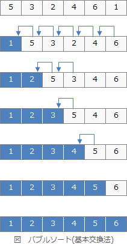
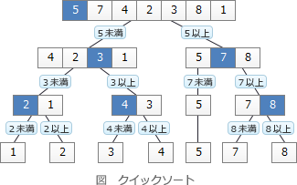
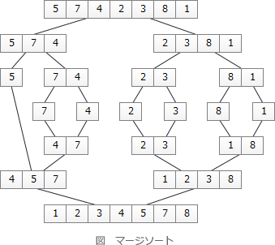
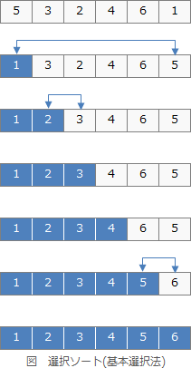

# [令和6年春期 午前 問7](https://www.ap-siken.com/kakomon/06_haru/q7.html)

#問題 #テクノロジ #アルゴリズムとプログラミング #アルゴリズム

解説を表示解説を隠す

<strong>問7</strong>　整列方法に関するアルゴリズムの記述のうち，バブルソートの記述はどれか。ここで，整列対象は重複のない1から9の数字がランダムに並んでいる数字列とする。

<ul class="ap-choices">
<li class="ap-choice-item ap-correct">

ア　数字列の最後の数字から最初の数字に向かって，隣り合う二つの数字を比較して小さい数字が前に来るよう数字を入れ替える操作を繰り返し行う。

正しい。隣り合う二つの数字の比較と入れ替えを繰り返す記述は<a href="用語/バブルソート" class="internal-link" data-href="用語/バブルソート">バブルソート</a>の説明。

</li>
<li class="ap-choice-item ap-wrong">

イ　数字列の中からランダムに基準となる数を選び，基準より小さい数と大きい数の二つのグループに分け，それぞれのグループ内も同じ操作を繰り返し行う。

基準値で分割して再帰する方式は<a href="用語/クイックソート" class="internal-link" data-href="用語/クイックソート">クイックソート</a>の説明。

</li>
<li class="ap-choice-item ap-wrong">

ウ　数字列をほぼ同じ長さの二つの数字列のグループに分割していき，分割できなくなった時点から，グループ内で数字が小さい順に並べる操作を繰り返し行う。

<a href="用語/分割統治法" class="internal-link" data-href="用語/分割統治法">分割統治法</a>で部分列をマージする方式は<a href="用語/マージソート" class="internal-link" data-href="用語/マージソート">マージソート</a>の説明。

</li>
<li class="ap-choice-item ap-wrong">

エ　未処理の数字列の中から最小値を探索し，未処理の数字列の最初の数字と入れ替える操作を繰り返し行う。

最小値を先頭へ移す操作の繰り返しは<a href="用語/選択ソート" class="internal-link" data-href="用語/選択ソート">選択ソート</a>の説明。

</li>
</ul>

<h4>解説</h4>

<a href="用語/バブルソート" class="internal-link" data-href="用語/バブルソート">バブルソート</a>は、隣り合う要素を比較し大小関係が逆順になっていればその二つの要素の位置を交換することを繰り返すことで整列を行う<a href="用語/アルゴリズム" class="internal-link" data-href="用語/アルゴリズム">アルゴリズム</a>です。単純交換法、隣接交換法、基本交換法とも呼ばれます。大きい（小さい）要素が端に移動していく様子が、浮かび上がってくる泡のように見えることから<a href="用語/バブルソート" class="internal-link" data-href="用語/バブルソート">バブルソート</a>と呼ばれます。単純で実装が容易なため、ソート<a href="用語/アルゴリズム" class="internal-link" data-href="用語/アルゴリズム">アルゴリズム</a>の学習で取り上げられる機会が多い整列法です。

<a href="用語/クイックソート" class="internal-link" data-href="用語/クイックソート">クイックソート</a>の説明です。 

<a href="用語/マージソート" class="internal-link" data-href="用語/マージソート">マージソート</a>の説明です。 

<a href="用語/選択ソート" class="internal-link" data-href="用語/選択ソート">選択ソート</a>の説明です。 

