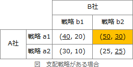
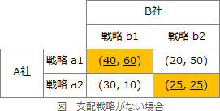

# [令和6年春期 午前 問73](https://www.ap-siken.com/kakomon/06_haru/q73.html)

#問題 #ストラテジ #企業活動 #業務分析・データ利活用

解説を表示解説を隠す

<strong>問73</strong>　ゲーム理論における"ナッシュ均衡"の説明はどれか。

<ul class="ap-choices">
<li class="ap-choice-item ap-wrong">

ア　一部プレイヤーの受取が，そのまま残りのプレイヤーの支払となるような，各プレイヤーの利得(正負の支払)の総和がゼロとなる状態

これはゼロサムゲームの説明です。

</li>
<li class="ap-choice-item ap-wrong">

イ　戦略を決定するに当たって，相手側の各戦略(行動)について，相手の結果が最大利得となる場合同士を比較して，その中で相手の利得を最小化する行動を選択している状態

これはミニマックス戦略の説明です。

</li>
<li class="ap-choice-item ap-wrong">

ウ　戦略を決定するに当たって，自身の各戦略(行動)について，自身の結果が最小利得となる場合同士を比較して，その中で自身の利得を最大化する行動を選択している状態

これはマクシミン戦略の説明です。

</li>
<li class="ap-choice-item ap-correct">

エ　非協力ゲームのモデルであり，相手の行動に対して最適な行動をとる行動原理の中で，どのプレイヤーも自分だけが戦略を変更しても利得を増やせない戦略の組合せ状態

正しい。<a href="用語/ナッシュ均衡" class="internal-link" data-href="用語/ナッシュ均衡">ナッシュ均衡</a>の説明です。

</li>
</ul>

<h4>解説</h4>

<a href="用語/ナッシュ均衡" class="internal-link" data-href="用語/ナッシュ均衡">ナッシュ均衡</a>は、ゲームに参加する各プレイヤーが、相手が選択すると予想される戦略に対して、自分の利得が最も大きくなる戦略(最適反応戦略)を選択している状態です。<a href="用語/ゲーム理論" class="internal-link" data-href="用語/ゲーム理論">ゲーム理論</a>において解となる戦略の組合せとなります。

2つの具体例で考えていきます。まず1つ目は支配戦略がある場合です。表中において、()内は(A社の利得，B社の利得)を、数字の下線は最適反応戦略であることをそれぞれ示します。

このケースでは、A社は、B社がb1・b2のどちらを選ぶかにかかわらず戦略a1を選択したほうが利得が大きくなり、またB社も、A社がa1・a2のどちらを選ぶかにかかわらず戦略b2を選択したほうが利得が大きくなります。このため、A社はa1を、B社はb2を選択するのが最適反応戦略となります。したがって、(a1, b2)の組合せが<a href="用語/ナッシュ均衡" class="internal-link" data-href="用語/ナッシュ均衡">ナッシュ均衡</a>となります。

2つ目は支配戦略がない場合です。

このケースでは、相手の戦略によって、自分の利得を最大化する戦略が異なります。A社は、B社がb1を選択したときはa1を、b2を選択したときはa2を選択したほうが利得が大きくなります。B社は、A社がa1を選択したときはb1を、a2を選択したときはb2を選択したほうが利得が大きくなります。したがって、(a1, b1)と(a2, b2)の2つの組合せが<a href="用語/ナッシュ均衡" class="internal-link" data-href="用語/ナッシュ均衡">ナッシュ均衡</a>となります。

このように、ゲームのプレイヤーが互いに、相手の戦略に対する最適反応戦略を選択しあっている状態が<a href="用語/ナッシュ均衡" class="internal-link" data-href="用語/ナッシュ均衡">ナッシュ均衡</a>です。

