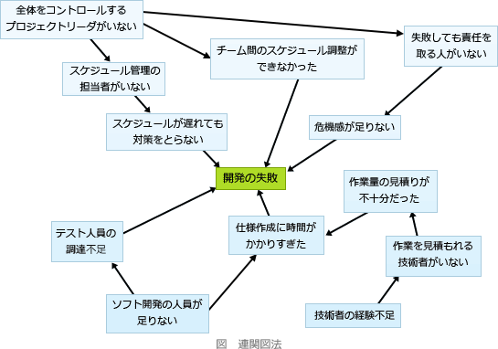

# [R6春期 午前 問74](https://www.ap-siken.com/kakomon/06_haru/q74.html)

#問題 #ストラテジ #企業活動 #業務分析・データ利活用

解説を表示解説を隠す

<strong>問74</strong>　分析対象としている問題に数多くの要因が関係し，それらが相互に絡み合っているとき，原因と結果，目的と手段といった関係を追求していくことによって，因果関係を明らかにし，解決の糸口をつかむための図はどれか。

<ul class="ap-choices">
<li class="ap-choice-item ap-wrong">

ア　アローダイアグラム

これは<a href="用語/アローダイアグラム" class="internal-link" data-href="用語/アローダイアグラム">アローダイアグラム</a>の説明です。

</li>
<li class="ap-choice-item ap-wrong">

イ　パレート図

これは<a href="用語/パレート図" class="internal-link" data-href="用語/パレート図">パレート図</a>の説明です。

</li>
<li class="ap-choice-item ap-wrong">

ウ　マトリックス図

これは<a href="用語/マトリックス図法" class="internal-link" data-href="用語/マトリックス図法">マトリックス図法</a>の説明です。

</li>
<li class="ap-choice-item ap-correct">

エ　連関図

正しい。<a href="用語/連関図法" class="internal-link" data-href="用語/連関図法">連関図法</a>の説明です。

</li>
</ul>

<h4>解説</h4>

<a href="用語/アローダイアグラム" class="internal-link" data-href="用語/アローダイアグラム">アローダイアグラム</a>は、プロジェクトの各作業間の関連性や順序関係を視覚的に表現する図です。

<a href="用語/パレート図" class="internal-link" data-href="用語/パレート図">パレート図</a>は、値の大きい順に分析対象の項目を並べた棒グラフと、累積構成比を表す折れ線グラフを組み合わせた複合グラフで、主に複数の分析対象の中から、重要である要素を識別するために使用されます。

<a href="用語/マトリックス図法" class="internal-link" data-href="用語/マトリックス図法">マトリックス図</a>は、表の縦軸と横軸にいくつかの項目を設定し、交点に各項目同士の関連性・関連度合いなどを文字列や数値または記号などで表した分析図です。

<a href="用語/連関図法" class="internal-link" data-href="用語/連関図法">連関図</a>は、複雑な要因の絡み合う事象について、その事象間の因果関係や相互関係を整理していくことで問題や原因を明らかにし、課題解決のための糸口を発見する手法です。中央に課題を置き、その周りに事象を置いていく作成方法が一般的です。

