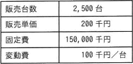

# [R6春期 午前 問76](https://www.ap-siken.com/kakomon/06_haru/q76.html)

#問題 #ストラテジ #企業活動 #会計・財務

解説を表示解説を隠す

<strong>問76</strong>　今年度のA社の販売実績と費用(固定費，変動費)を表に示す。来年度，固定費が5%増加し，販売単価が5%低下すると予測されるとき，今年度と同じ営業利益を確保するためには，最低何台を販売する必要があるか。 

<ul class="ap-choices">
<li class="ap-choice-item ap-wrong">

ア　2,575

今年度と同じ営業利益を確保するための最低<a href="用語/販売" class="internal-link" data-href="用語/販売">販売</a>台数ではありません。

</li>
<li class="ap-choice-item ap-wrong">

イ　2,750

今年度と同じ営業利益を確保するための最低<a href="用語/販売" class="internal-link" data-href="用語/販売">販売</a>台数ではありません。

</li>
<li class="ap-choice-item ap-wrong">

ウ　2,778

今年度と同じ営業利益を確保するための最低<a href="用語/販売" class="internal-link" data-href="用語/販売">販売</a>台数ではありません。

</li>
<li class="ap-choice-item ap-correct">

エ　2,862

正しい。最低限必要な<a href="用語/販売" class="internal-link" data-href="用語/販売">販売</a>台数は2,862台です。

</li>
</ul>

<h4>解説</h4>

営業利益は「売上高－変動費－固定費」で計算できるので、この式に今年度の数値を当てはめると、今年度の営業利益は、 2,500×200－2,500×100－150,000 ＝500,000－250,000－150,000 ＝100,000(千円)

来年度は固定費が5％増加し「150,000千円×(1＋0.05)＝157,500千円」に、<a href="用語/販売" class="internal-link" data-href="用語/販売">販売</a>単価が5％低下し「200千円×(1－0.05)＝190千円」になるという予測なので、<a href="用語/販売" class="internal-link" data-href="用語/販売">販売</a>台数をNとして関係式を作り、今年度と同じ営業利益を得るために必要な<a href="用語/販売" class="internal-link" data-href="用語/販売">販売</a>台数を求めます。 100,000＝190×N－100×N－157,500 100,000＝90N－157,500 90N＝257,500 N＝2,861.11… （小数点以下を切り上げて）2,862(台)

方程式の解より、最低限必要な<a href="用語/販売" class="internal-link" data-href="用語/販売">販売</a>台数は「2,862台」であるとわかります。

