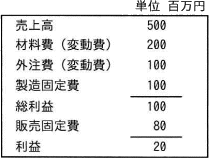

# [R6春期 午前 問77](https://www.ap-siken.com/kakomon/06_haru/q77.html)

#問題 #ストラテジ #企業活動 #会計・財務

解説を表示解説を隠す

<strong>問77</strong>　損益計算資料から求められる損益分岐点売上高は，何百万円か。 

<ul class="ap-choices">
<li class="ap-choice-item ap-wrong">

ア　225

<a href="用語/損益分岐点" class="internal-link" data-href="用語/損益分岐点">損益分岐点</a>売上高の計算結果ではありません。

</li>
<li class="ap-choice-item ap-wrong">

イ　300

<a href="用語/損益分岐点" class="internal-link" data-href="用語/損益分岐点">損益分岐点</a>売上高の計算結果ではありません。

</li>
<li class="ap-choice-item ap-correct">

ウ　450

正しい。<a href="用語/損益分岐点" class="internal-link" data-href="用語/損益分岐点">損益分岐点</a>売上高は450百万円です。

</li>
<li class="ap-choice-item ap-wrong">

エ　480

<a href="用語/損益分岐点" class="internal-link" data-href="用語/損益分岐点">損益分岐点</a>売上高の計算結果ではありません。

</li>
</ul>

<h4>解説</h4>

<a href="用語/損益分岐点" class="internal-link" data-href="用語/損益分岐点">損益分岐点</a>売上高は、次の公式で計算することができます。 <a href="用語/損益分岐点" class="internal-link" data-href="用語/損益分岐点">損益分岐点</a>売上高＝固定費／(1－変動費率) 変動費率＝変動費／売上高

設問の損益計算資料においては、 変動費：材料費200＋外注費100＝300 固定費：製造固定費100＋販売固定費80＝180 変動費率：(200＋100)／500＝0.6 になるので、<a href="用語/損益分岐点" class="internal-link" data-href="用語/損益分岐点">損益分岐点</a>売上高は、 180／(1－0.6) ＝180／0.4＝450 上記の計算結果から450百万円とわかります。

