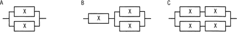

# [令和6年秋期 午前 問14](https://www.ap-siken.com/kakomon/06_aki/q14.html)

#問題 #テクノロジ #システム構成要素 #システムの評価指標

解説を表示解説を隠す

<strong>問14</strong>　稼働率が等しい装置Xを直列や並列に組み合わせたとき，システム全体の稼働率を高い順に並べたものはどれか。ここで，装置Xの稼働率は0より大きく1未満である。 

<ul class="ap-choices">
<li class="ap-choice-item ap-wrong">

ア　A，B，C

Bの<a href="用語/稼働率" class="internal-link" data-href="用語/稼働率">稼働率</a>はAより低く、CはBより高いため、この順序は正しくありません。

</li>
<li class="ap-choice-item ap-correct">

イ　A，C，B

正しい。Aが最も高く、次いでC、Bの順になります。

</li>
<li class="ap-choice-item ap-wrong">

ウ　C，A，B

Aの<a href="用語/稼働率" class="internal-link" data-href="用語/稼働率">稼働率</a>はCより高いため、この順序は正しくありません。

</li>
<li class="ap-choice-item ap-wrong">

エ　C，B，A

Aの<a href="用語/稼働率" class="internal-link" data-href="用語/稼働率">稼働率</a>が最も高いため、この順序は正しくありません。

</li>
</ul>

<h4>解説</h4>

各装置の<a href="用語/稼働率" class="internal-link" data-href="用語/稼働率">稼働率</a>は等しく、0より大きく1未満とあるので、仮に<a href="用語/稼働率" class="internal-link" data-href="用語/稼働率">稼働率</a>0.9を当てはめて、システム全体の<a href="用語/稼働率" class="internal-link" data-href="用語/稼働率">稼働率</a>を比較します。直列接続の<a href="用語/稼働率" class="internal-link" data-href="用語/稼働率">稼働率</a>を求める式はR2、並列接続の<a href="用語/稼働率" class="internal-link" data-href="用語/稼働率">稼働率</a>を求める式は「1－(1－R)2」です。

【A】2台の並列接続なので、1－(1－0.9)2＝1－0.12＝1－0.01＝0.99

【B】<a href="用語/稼働率" class="internal-link" data-href="用語/稼働率">稼働率</a>0.99であるAの構成部分に、装置1台が直列接続されているので、0.9×0.99＝0.891

【C】装置2台の直列接続は、0.9×0.9＝0.81。<a href="用語/稼働率" class="internal-link" data-href="用語/稼働率">稼働率</a>0.81の構成部分が並列に接続されているので、1－(1－0.81)2＝1－0.192＝1－0.0361＝0.9639

したがって、<a href="用語/稼働率" class="internal-link" data-href="用語/稼働率">稼働率</a>の高い順に「A，C，B」となります。

