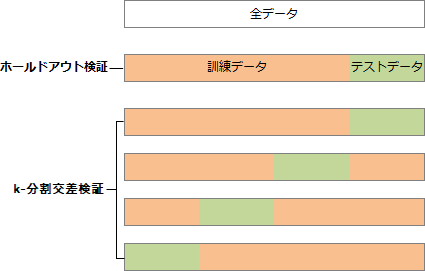

# [令和6年秋期 午前 問2](https://www.ap-siken.com/kakomon/06_aki/q2.html)

#問題 #テクノロジ #基礎理論 #情報に関する理論

解説を表示解説を隠す

<strong>問2</strong>　AIにおける教師あり学習での交差検証に関する記述はどれか。

<ul class="ap-choices">
<li class="ap-choice-item ap-wrong">

ア　過学習を防ぐために，回帰モデルに複雑さを表すペナルティ項を加え，訓練データへ過剰に適合しないようにモデルを調整する。

これは<a href="用語/正則化" class="internal-link" data-href="用語/正則化">正則化</a>の説明です。

</li>
<li class="ap-choice-item ap-wrong">

イ　学習の精度を高めるために，複数の異なるアルゴリズムのモデルで学習し，学習の結果は組み合わせて評価する。

これは<a href="用語/アンサンブル学習" class="internal-link" data-href="用語/アンサンブル学習">アンサンブル学習</a>の説明です。

</li>
<li class="ap-choice-item ap-wrong">

ウ　学習モデルの汎化性能を高めるために，単一のモデルで関連する複数の課題を学習することによって，課題間に共通する要因を獲得する。

これは<a href="用語/マルチタスク" class="internal-link" data-href="用語/マルチタスク">マルチタスク</a>学習の説明です。

</li>
<li class="ap-choice-item ap-correct">

エ　学習モデルの汎化性能を評価するために，データを複数のグループに分割し，一部を学習に残りを評価に使い，順にグループを入れ替えて学習と評価を繰り返す。

正しい。<a href="用語/交差検証" class="internal-link" data-href="用語/交差検証">交差検証</a>の説明です。

</li>
</ul>

<h4>解説</h4>

<a href="用語/交差検証" class="internal-link" data-href="用語/交差検証">交差検証</a>は、<a href="用語/機械学習" class="internal-link" data-href="用語/機械学習">機械学習</a>モデルを評価するための手法で、1つのデータセットを<a href="用語/学習データ" class="internal-link" data-href="用語/学習データ">学習データ</a>と<a href="用語/テストデータ" class="internal-link" data-href="用語/テストデータ">テストデータ</a>に複数回分割し、それぞれで学習と評価を行うものです。各検証で得られた<a href="用語/評価指標" class="internal-link" data-href="用語/評価指標">評価指標</a>を平均化することで、全体としてのモデルの性能を評価します。データセットの件数が少ない場合でも信頼性の高い評価が可能となっています。

