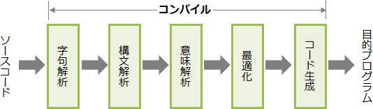

# [令和6年秋期 午前 問20](https://www.ap-siken.com/kakomon/06_aki/q20.html)

#問題 #テクノロジ #ソフトウェア #開発ツール

解説を表示解説を隠す

<strong>問20</strong>　手続型言語のコンパイラがコード生成までに行う処理のうち，最後に行う処理はどれか。

<ul class="ap-choices">
<li class="ap-choice-item ap-wrong">

ア　意味解析

<a href="用語/意味解析" class="internal-link" data-href="用語/意味解析">意味解析</a>は<a href="用語/最適化" class="internal-link" data-href="用語/最適化">最適化</a>より前の段階であり，コード生成の直前には来ない。

</li>
<li class="ap-choice-item ap-wrong">

イ　構文解析

<a href="用語/構文解析" class="internal-link" data-href="用語/構文解析">構文解析</a>は字句解析の次の段階であり，コード生成の直前には来ない。

</li>
<li class="ap-choice-item ap-correct">

ウ　最適化

正しい。コンパイル処理は字句解析→<a href="用語/構文解析" class="internal-link" data-href="用語/構文解析">構文解析</a>→<a href="用語/意味解析" class="internal-link" data-href="用語/意味解析">意味解析</a>→<a href="用語/最適化" class="internal-link" data-href="用語/最適化">最適化</a>→コード生成の順で行われるため，コード生成の直前は<a href="用語/最適化" class="internal-link" data-href="用語/最適化">最適化</a>。

</li>
<li class="ap-choice-item ap-wrong">

エ　字句解析

字句解析はコンパイル処理の最初の段階である。

</li>
</ul>

<h4>解説</h4>

<a href="用語/コンパイラ" class="internal-link" data-href="用語/コンパイラ">コンパイラ</a>は，高水準語で記述されたソースコードをコンピュータが理解できる機械語に一括変換する（＝コンパイルする）ソフトウェアです。

コンパイルには，①字句解析 → ②<a href="用語/構文解析" class="internal-link" data-href="用語/構文解析">構文解析</a> → ③<a href="用語/意味解析" class="internal-link" data-href="用語/意味解析">意味解析</a> → ④<a href="用語/最適化" class="internal-link" data-href="用語/最適化">最適化</a> → ⑤コード生成 の5つの処理段階があり，この順番で実行されていきます。

<strong>字句解析</strong> … プログラムを表現する文字列を，意味のある最小の構成要素（トークン）に分解する。 例: <code>int a = 5 + 3;</code> → int（型），a（変数），=（代入演算子），5（整数），+（加算演算子），3（整数），;（セミコロン）

<strong><a href="用語/構文解析" class="internal-link" data-href="用語/構文解析">構文解析</a></strong> … 字句解析で得られたトークンをもとに，言語の文法に基づいてプログラムを解析し，文法誤りがないかチェックする。構文木を使用してプログラムの構造を表現する。

<strong><a href="用語/意味解析" class="internal-link" data-href="用語/意味解析">意味解析</a></strong> … プログラムが意味的に正しいかを検証する。変数の宣言と使用とを対応付けたり，演算におけるデータ型の整合性を確認する。

<strong><a href="用語/最適化" class="internal-link" data-href="用語/最適化">最適化</a></strong> … コードの実行効率を向上させるために，不要な演算の省略，ループの展開，関数のインライン展開，レジスタ割付けなどの変換を行う。 例: <code>int a = 2 * 5;</code> → <code>int a = 10;</code>

<strong>コード生成</strong> … 構文木を元にデータの記憶位置，レジスタ割当てを確定し，コンピュータが実行可能な機械語やアセンブリ言語，中間コードとして出力する。

4つのうち，<a href="用語/コンパイラ" class="internal-link" data-href="用語/コンパイラ">コンパイラ</a>がコードを生成する前に最後に行う処理は「<a href="用語/最適化" class="internal-link" data-href="用語/最適化">最適化</a>」です。したがって「ウ」が正解です。

