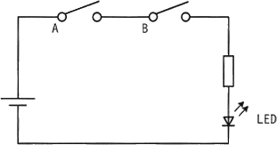
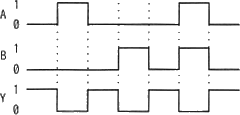
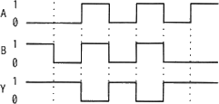

# [令和6年秋期 午前 問21](https://www.ap-siken.com/kakomon/06_aki/q21.html)

#問題 #テクノロジ #ハードウェア

解説を表示解説を隠す

<strong>問21</strong>　図はスイッチA及びBの状態によって，LEDが点灯又は消灯する回路である。スイッチAがオンの状態をA＝1，オフの状態をA＝0とし，スイッチBも同様にオンの状態をB＝1，オフの状態をB＝0とする。また，LEDが点灯する状態をY＝1，消灯する状態をY＝0とする。このとき，図の回路を動作させたときのタイミングチャートとして，適切なものはどれか。 

<ul class="ap-choices">
<li class="ap-choice-item ap-wrong">

ア　

Yが1となるのは、AまたはBの少なくとも一方が1のときです。どちらか一方のスイッチONで点灯する動作を表すので誤りです。論理回路でいえばY = A OR Bに相当します。

</li>
<li class="ap-choice-item ap-wrong">

イ　

Yが1となるのは、AとBの両方が0のときだけです。両方のスイッチOFFで点灯する動作を表すので誤りです。論理回路でいえばY = A NOR Bに相当します。

</li>
<li class="ap-choice-item ap-correct">

ウ　

正しい。Yが1となるのは、AとBの両方が1のときだけです。両方のスイッチONで点灯する動作を表すので、図の回路に対応します。

</li>
<li class="ap-choice-item ap-wrong">

エ　

Yが1となるのは、AとBの両方が1のとき以外です。両方がスイッチONのとき以外で点灯する動作を表すので誤りです。論理回路でいえばY = A NAND Bに相当します。

</li>
</ul>

<h4>解説</h4>

図の回路は、スイッチAとスイッチBの両方がONのときだけ通電し、<a href="用語/LED" class="internal-link" data-href="用語/LED">LED</a>が点灯します。この回路の動作は、A＝B＝1である場合のみY＝1、それ以外の場合にはY＝0となっているチャートに対応します。論理回路でいえばY = A AND Bに相当します。

