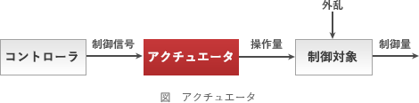

# [令和6年秋期 午前 問23](https://www.ap-siken.com/kakomon/06_aki/q23.html)

#問題 #テクノロジ #ハードウェア

解説を表示解説を隠す

<strong>問23</strong>　アクチュエーターの説明として，適切なものはどれか。

<ul class="ap-choices">
<li class="ap-choice-item ap-wrong">

ア　与えられた目標量と，センサーから得られた制御量を比較し，制御量を目標量に一致させるように操作量を出力する。

これはコントローラーの説明です。

</li>
<li class="ap-choice-item ap-wrong">

イ　位置，角度，速度，加速度，力，温度などを検出し，電気的な情報に変換する。

これは<a href="用語/センサー" class="internal-link" data-href="用語/センサー">センサー</a>の説明です。

</li>
<li class="ap-choice-item ap-correct">

ウ　エネルギー源からのパワーを，回転，直進などの動きに変換する。

正しい。<a href="用語/アクチュエーター" class="internal-link" data-href="用語/アクチュエーター">アクチュエーター</a>の説明です。

</li>
<li class="ap-choice-item ap-wrong">

エ　マイクロフォン，センサーなどが出力する微小な電気信号を増幅する。

これはアンプの説明です。

</li>
</ul>

<h4>解説</h4>

<a href="用語/アクチュエーター" class="internal-link" data-href="用語/アクチュエーター">アクチュエーター</a>(Actuator)は、入力された電気信号を力学的な運動に変換する駆動機構で、機械や電気回路の構成要素です。制御システムにおいては、コントローラーから制御信号を受けとり、制御対象に与える操作量を変化させる部位のことをいいます。具体的には、温度管理システムにおけるファン、自動ドアシステムのドア、工場におけるロボットアームなど、物理的なアクションを起こす部分の駆動機構がこれに該当します。

