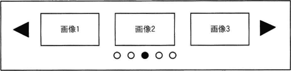
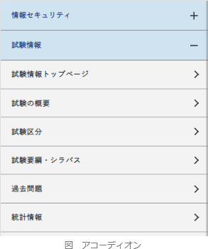
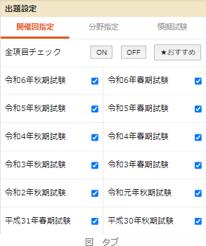
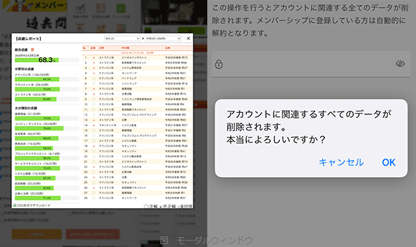

# [令和6年秋期 午前 問25](https://www.ap-siken.com/kakomon/06_aki/q25.html)

#問題 #テクノロジ #ユーザーインタフェース #UX/UIデザイン

解説を表示解説を隠す

<strong>問25</strong>　Webページの構成要素のうち，図のような固定の表示領域内でマウス操作やタッチ操作を行うことによってスクロールし，複数の画像などが横方向に順次表示されるものを何というか。 

<ul class="ap-choices">
<li class="ap-choice-item ap-wrong">

ア　アコーディオン

これは<a href="用語/アコーディオン" class="internal-link" data-href="用語/アコーディオン">アコーディオン</a>の説明です。見出し部分をクリックやタップすることで、コンテンツを展開・折りたたみ可能なUI要素です。主に縦に並べられた多くの情報を省スペースで整理するために使用されます。

</li>
<li class="ap-choice-item ap-correct">

イ　カルーセル

正しい。<a href="用語/カルーセル" class="internal-link" data-href="用語/カルーセル">カルーセル</a>は、複数の画像やコンテンツを固定領域内に配置し、利用者がスワイプや左右の矢印、点（インジケーター）で横スクロールすることで一連のコンテンツを順次表示するUI要素です。画像ギャラリーやスライドショーなど、限られた領域で多くのコンテンツを見せたい場合に使用されます。

</li>
<li class="ap-choice-item ap-wrong">

ウ　タブ

これはタブの説明です。上部の見出し部分をクリックすることで、表示するコンテンツを切り替えるUI要素です。本の索引などに使われる紙タブを模したものです。

</li>
<li class="ap-choice-item ap-wrong">

エ　モーダルウィンドウ

これはモーダル<a href="用語/ウィンドウ" class="internal-link" data-href="用語/ウィンドウ">ウィンドウ</a>の説明です。Webページ内の別のコンテンツや特定のアクションを強調するために、画面上に浮かぶように表示される一時的なウィンドウです。表示されている時は、背景にあるコンテンツの操作が禁止されます。

</li>
</ul>

<h4>解説</h4>

設問のUIは、固定領域内で横方向にコンテンツを順次表示する<a href="用語/カルーセル" class="internal-link" data-href="用語/カルーセル">カルーセル</a>です。画像ギャラリーやスライドショーなど、限られた領域で多くのコンテンツを見せたい場合に使用されます。したがって「イ」が正解です。

<a href="用語/アコーディオン" class="internal-link" data-href="用語/アコーディオン">アコーディオン</a>は、見出し部分をクリックやタップすることで、コンテンツを展開・折りたたみ可能なUI要素です。主に縦に並べられた多くの情報を省スペースで整理するために使用されます。 

正しい。<a href="用語/カルーセル" class="internal-link" data-href="用語/カルーセル">カルーセル</a>は、複数の画像やコンテンツを固定領域内に配置し、利用者がスワイプや左右の矢印、点（インジケーター）で横スクロールすることで一連のコンテンツを順次表示するUI要素です。画像ギャラリーやスライドショーなど、限られた領域で多くのコンテンツを見せたい場合に使用されます。 

タブは、上部の見出し部分をクリックすることで、表示するコンテンツを切り替えるUI要素です。本の索引などに使われる紙タブを模したものです。 

モーダル<a href="用語/ウィンドウ" class="internal-link" data-href="用語/ウィンドウ">ウィンドウ</a>は、Webページ内の別のコンテンツや特定のアクションを強調するために、画面上に浮かぶように表示される一時的なウィンドウです。表示されている時は、背景にあるコンテンツの操作が禁止されます。 

