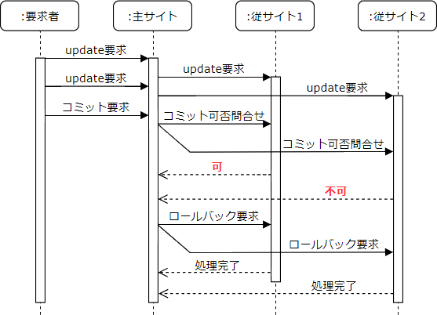
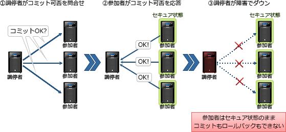

# [令和6年秋期 午前 問27](https://www.ap-siken.com/kakomon/06_aki/q27.html)

#問題 #テクノロジ #データベース #トランザクション処理

解説を表示解説を隠す

<strong>問27</strong>　2相コミットで分散トランザクションの原子性を保証する場合，ネットワーク障害の発生によって参加者のトランザクションが，コミットすべきかロールバックすべきかを判断できなくなることがある。このような状況を発生させるネットワーク障害に関する説明として，適切なものはどれか。

<ul class="ap-choices">
<li class="ap-choice-item ap-wrong">

ア　調停者のトランザクションが，コミット又はロールバック可否の問合せを参加者に送る直前に障害になった。

調停者またはネットワークが第1相の開始時に障害でダウンした場合、各参加者はタイムアウトとみなして<a href="用語/ロールバック" class="internal-link" data-href="用語/ロールバック">ロールバック</a>を行います。

</li>
<li class="ap-choice-item ap-correct">

イ　調停者のトランザクションが，コミット又はロールバックの決定を参加者に送る直前に障害になった。

正しい。セキュア状態になった後に調停者からの通知がない場合、参加者はコミット／<a href="用語/ロールバック" class="internal-link" data-href="用語/ロールバック">ロールバック</a>の判断をすることができません。

</li>
<li class="ap-choice-item ap-wrong">

ウ　調停者のトランザクションに，コミット又はロールバック可否の応答を参加者が返す直前に障害になった。

一定時間内に各参加者からの可否の応答がない場合、調停者はタイムアウトとみなして<a href="用語/トランザクション" class="internal-link" data-href="用語/トランザクション">トランザクション</a>を中止し、各参加者に<a href="用語/ロールバック" class="internal-link" data-href="用語/ロールバック">ロールバック</a>を命じます。参加者が判断に困ることはありません。

</li>
<li class="ap-choice-item ap-wrong">

エ　調停者のトランザクションに，コミット又はロールバックの完了を参加者が返す直前に障害になった。

各参加者が調停者からコミット／<a href="用語/ロールバック" class="internal-link" data-href="用語/ロールバック">ロールバック</a>の指示を受け取り、その処理を完了した後に障害が発生します。すでにどちらのアクションを行うべきか決定しているため、判断に困ることはありません。

</li>
</ul>

<h4>解説</h4>

2相コミットは、<a href="用語/分散データベース" class="internal-link" data-href="用語/分散データベース">分散データベース</a>環境での<a href="用語/トランザクション" class="internal-link" data-href="用語/トランザクション">トランザクション</a>の原子性・<a href="用語/一貫性" class="internal-link" data-href="用語/一貫性">一貫性</a>を確保するために、<a href="用語/トランザクション" class="internal-link" data-href="用語/トランザクション">トランザクション</a>のコミットについて、①各サイトに対して更新可能かを問い合わせるフェーズ（第1相）と、②全サイトの合意が得られた後に変更を確定するフェーズ（第2相）の2つの段階に分けて実行する手法です。本問でいえばコミット／<a href="用語/ロールバック" class="internal-link" data-href="用語/ロールバック">ロールバック</a>について「可否の問合せを参加者に送る」のが第1相、「決定を参加者に送る」のが第2相の動作に相当します。

2相コミットの流れは下図のとおりです。図中の主サイトは「調停者」、従サイトは「参加者」を表します。

2相コミットでは、調停者にコミットの可否を応答した参加者は、いつでもコミットまたは<a href="用語/ロールバック" class="internal-link" data-href="用語/ロールバック">ロールバック</a>が可能なセキュア状態（中間状態）に遷移します。この際、参加者は調停者からの指示を受け取るまで待ち状態となります。そのため、調停者が各サブ<a href="用語/トランザクション" class="internal-link" data-href="用語/トランザクション">トランザクション</a>からの応答を受けとった後、行うべきアクションを各サイトに通知する前（第2相の開始時）に障害が発生すると、待ち状態の参加者はコミットすべきか<a href="用語/ロールバック" class="internal-link" data-href="用語/ロールバック">ロールバック</a>すべきかを判断できない不定状態に陥ります。

